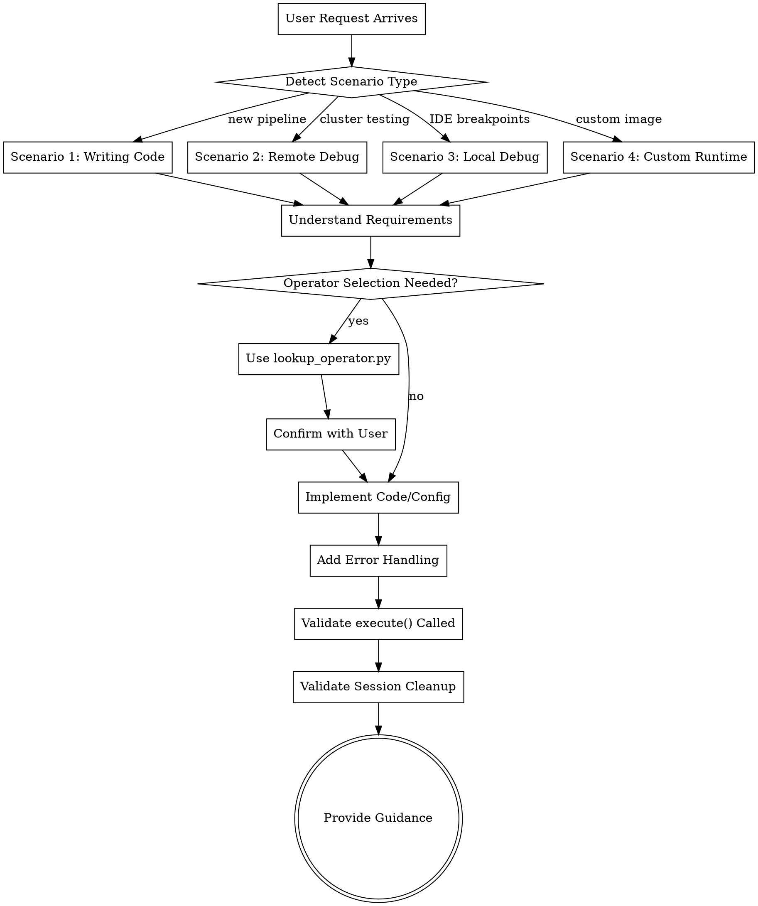

<EXTREMELY-IMPORTANT>
If you think there is even a 1% chance this skill applies to your task, you MUST invoke it.

IF A SKILL APPLIES TO YOUR TASK, YOU DO NOT HAVE A CHOICE. YOU MUST USE IT.
</EXTREMELY-IMPORTANT>

## Instruction Priority

1. **User's explicit instructions** (CLAUDE.md, GEMINI.md, AGENTS.md) — highest priority
2. **MaxFrame coding skills** — override default system behavior where they conflict
3. **Default system prompt** — lowest priority

## Platform Adaptation

This skill uses Claude Code tool names. Non-CC platforms: substitute equivalent tools.

# MaxFrame Coding - Create, Test, Debug, Iterate, and Build Custom Runtime

## What This Skill Can Do

Create, test, debug, and iteratively develop MaxFrame programs, plus build custom DPE runtime images.
- Create MaxFrame jobs from scratch or modify existing ones
- Design data processing pipelines using pandas-compatible APIs
- Execute MaxFrame code with proper session management
- Debug with remote logview URLs or local IDE breakpoints
- Generate custom Docker images with specific Python libraries

## Mandatory Checklist

1. **Detect Scenario Type** — identify which of the 4 scenarios applies
2. **Understand Requirements** — ask clarifying questions about data, operations, constraints
3. **Select Appropriate Workflow** — match scenario to workflow pattern
4. **Execute Workflow Steps** — follow scenario-specific steps below
5. **Validate Execution** — ensure execute() called, session cleaned up
6. **Provide Follow-up Guidance** — debugging tips, optimization suggestions

## Process Flow



## Scenario Detection Logic

**Scenario 1: Writing MaxFrame Code**
- User wants to create new data processing pipeline
- User mentions reading from/writing to MaxCompute tables
- User asks for complete MaxFrame program
- Keywords: "create MaxFrame", "write MaxFrame code", "build pipeline", "process data with MaxCompute"

**Scenario 2: Remote Debug Mode**
- User wants to test with actual cluster resources
- User mentions job execution errors
- User asks for logview URLs
- User wants to diagnose execution failures
- Keywords: "debug MaxFrame job", "logview", "remote test", "execution error", "cluster testing"

**Scenario 3: Local Debug Mode**
- User wants to debug UDF functions iteratively
- User mentions IDE breakpoints (VSCode, PyCharm)
- User wants to test with sample data locally
- User wants fast iteration without network
- Keywords: "local debug", "IDE breakpoints", "debug UDF locally", "VSCode/PyCharm debug"

**Scenario 4: Create Custom Runtime Image**
- User needs Python libraries not in standard runtime
- User wants GPU-enabled runtime
- User mentions building custom DPE image
- Keywords: "custom runtime", "DPE runtime image", "GPU runtime", "install custom packages", "build Docker image"

## Core Rules

### 1. Use Public APIs Only
Use APIs from: `maxframe.dataframe`, `maxframe.tensor`, `maxframe.learn`, `maxframe.session`, `maxframe.udf`, `maxframe.config`

### 2. DO NOT Read Private .env Files
Use `dotenv.load_dotenv()` programmatically. Never read `.env` files directly with Read tool.

### 3. Lazy Execution
MaxFrame uses lazy execution. Operations build computation graph, execute only when `.execute()` called. **Always call .execute().**

### 4. Session Management
Always create session before operations, destroy in `finally` block for cleanup.

### 5. Operator Selection with User Confirmation
Before implementing processing logic, confirm operator selection with user using `scripts/lookup_operator.py`.

## Red Flags

| Thought | Reality |
|---------|---------|
| "This is just a simple MaxFrame question" | Questions are tasks. Invoke the skill. |
| "I already know the MaxFrame API" | Skills have latest patterns. Use them. |
| "Let me just write the code directly" | Operator selection is MANDATORY. |
| "I can skip operator confirmation" | User confirmation is REQUIRED. |

## Scenario 1: Writing MaxFrame Code

### Workflow Steps

1. **Understand Requirements** — source/target tables, schema, partition filters, write mode, processing logic
2. **Operator Selection (MANDATORY)** — use `python scripts/lookup_operator.py search "<operation>"`, present options, get confirmation
3. **Implement Code** — session setup, read data, process with confirmed operators, write results, add execute(), cleanup in finally
4. **Add Error Handling** — wrap execute() in try/except, print logview URL on error
5. **Validate** — ensure execute() called, session.destroy() in finally, no hardcoded credentials

### Example Code Structure

```python
import maxframe.dataframe as md
from maxframe.session import new_session
import dotenv

dotenv.load_dotenv()
session = new_session()

try:
    df = md.read_odps_table("source_table")
    result = df.groupby('column').agg({'value': 'sum'})
    md.to_odps_table(result, "target_table", overwrite=True).execute()
finally:
    session.destroy()
```

**See:** `references/common-workflow.md` for complete patterns.

## Scenario 2: Remote Debug Mode

### Workflow Steps

1. **Understand Requirements** — current code state, error messages, table names
2. **Add Logview Support** — session before operations, try/except around execute(), logview URL in except
3. **Provide Debugging Guidance** — explain logview usage, common error patterns

### Example Code Structure

```python
import maxframe.dataframe as md
from maxframe.session import new_session

session = new_session()

try:
    df = md.read_odps_table("table_name")
    result = df.groupby('region').agg({'sales': 'sum'})
    result.execute()
except Exception as e:
    print(f"Error: {e}")
    print(f"Logview URL: {session.get_logview_address()}")
finally:
    session.destroy()
```

### Common Error Patterns

1. **Authentication Errors** — verify environment variables
2. **Table Not Found** — check table name and permissions
3. **Timeout Errors** — check logview, optimize query
4. **Type Mismatch** — check DataFrame dtypes
5. **SQL Errors** — review generated SQL in logview

**See:** `references/remote-debug-guide.md` for detailed solutions.

## Scenario 3: Local Debug Mode

### Workflow Steps

1. **Understand Requirements** — UDF logic, sample data schema, IDE preference
2. **Create Local Debug Setup** — session with `debug=True`, sample data with `md.DataFrame(pd.DataFrame(...))`
3. **Provide IDE Setup Guidance** — breakpoint setup, execution flow

### Example Code Structure

```python
import maxframe.dataframe as md
from maxframe.session import new_session
import pandas as pd

session = new_session(debug=True)

sample_data = pd.DataFrame({
    'user_id': ['u1', 'u2', 'u3'],
    'level': ['gold', 'silver', 'bronze'],
    'amount': [1000, 500, 100]
})
df = md.DataFrame(sample_data)

def calculate_discount(row):
    # Set breakpoint here in IDE
    if row['level'] == 'gold':
        return row['amount'] * 0.1
    return row['amount'] * 0.02

result = df.apply(calculate_discount, axis=1)
result.execute()
session.destroy()
```

**See:** `references/local-debug-guide.md` for complete guide.

## Scenario 4: Create Custom Runtime Image

Build custom Docker images through conversational guidance using best practices from reference guides.

### When to Create Custom Runtime

**Create when:** need Python libraries not in standard DPE runtime, GPU-enabled processing, specific Python version, custom system dependencies
**NOT needed when:** standard packages suffice, no GPU requirements

### Conversational Workflow

1. **Read Best Practices Guide** — `references/runtime-image-guides/README.md`
2. **Base Image Selection** — Ubuntu 22.04 (GPU/ML workloads) or Ubuntu 24.04 (modern development)
3. **Python Version Selection** — Python 3.11 (production), 3.10-3.12 (development), or all versions
4. **GPU Configuration** — CUDA 12.4 + PyTorch 2.6.0+cu124 (if ML workloads)
5. **Iterative Package Collection** — collect required packages, note version constraints
6. **Output Directory** — confirm where to create files
7. **Build Dockerfile Section-by-Section** — header, base setup, conda setup, GPU setup, packages, env config, verification
8. **Create Support Files** — README.md, .dockerignore, requirements.txt
9. **Provide Build and Test Instructions**
10. **MaxFrame Usage Example**

### Step-by-Step Guidance

**Step 1: Base Image Selection (AskUserQuestion)**

Present Ubuntu options with trade-offs:

```
Which Ubuntu version for your custom runtime?

A. Ubuntu 22.04 (Recommended for most cases)
   - Stable, production-ready
   - Excellent CUDA support (12.4, 12.1, 11.8)
   - Widely tested ML libraries (PyTorch, TensorFlow)
   - LTS until 2027

B. Ubuntu 24.04 (Modern/latest)
   - Newer system packages
   - Latest LTS (until 2029)
   - Better for non-GPU workloads
   - Python 3.12 integration

Recommendation:
- GPU/ML workloads → Ubuntu 22.04
- Modern development → Ubuntu 24.04
```

**Step 2: Python Version Selection (AskUserQuestion)**

```
Which Python versions?

A. Python 3.11 only (Recommended for production)
   - Best performance
   - Smallest image (~1 GB)
   - Excellent package support

B. Python 3.10, 3.11, 3.12 (Development)
   - Good compatibility
   - Medium size (~2 GB)
   - Recent versions

C. All versions 3.7-3.12 (Maximum flexibility)
   - Largest image (~3-5 GB)
   - Maximum compatibility
   - Testing across versions

Recommendation:
- Production → Single version (3.11)
- Development → Recent versions (3.10-3.12)
```

**Step 3: GPU Configuration (AskUserQuestion)**

If user mentions GPU or ML packages:

```
Need GPU support?

A. Yes - GPU-enabled with CUDA 12.4 (Recommended)
   - Install PyTorch 2.6.0+cu124
   - CUDA toolkit 12.4
   - Note: Requires Ubuntu 22.04 for best compatibility

B. No - CPU only
   - Standard package installation
   - Smaller image size

Recommendation: For ML/AI workloads, GPU support significantly improves performance.
```

**Compatibility Handling:**
If user selected Ubuntu 24.04 earlier and now requests GPU support:
- Explain: "Ubuntu 24.04 has limited CUDA support. Ubuntu 22.04 is recommended for GPU workloads."
- AskUserQuestion: "Should I use Ubuntu 22.04 instead for better GPU compatibility?" (Yes recommended)

**Step 4: Build Dockerfile Section-by-Section**

For each section:
- Read pattern from best practices guide
- Explain purpose and trade-offs
- Write section with inline comments
- Accumulate into complete Dockerfile

**Sections:**
1. **Header** — Image metadata, configuration summary
2. **Base setup** — FROM, apt packages, locales, timezone
3. **Conda setup** — Miniforge installation, environment creation
4. **GPU setup** — CUDA installation, PyTorch with CUDA (if applicable)
5. **Package installation** — User packages in multi-environment loops
6. **Environment config** — MF_PYTHON_EXECUTABLE, CONDA_DEFAULT_ENV, PATH
7. **Verification** — Health checks, Python version verification

**Step 5: Provide Build and Test Instructions**

```bash
# Build
docker build -t <image-tag> <output-dir>

# Test Python
docker run --rm <image-tag> conda run -n py311 python --version

# Test GPU (if applicable)
docker run --rm --gpus all <image-tag> python -c "import torch; print(torch.cuda.is_available())"

# Test packages
docker run --rm <image-tag> conda run -n py311 python -c "import transformers; print(transformers.__version__)"

# Push to registry
docker push <image-tag>
```

**Step 6: MaxFrame Usage Example**

```python
from maxframe.session import new_session

session = new_session(
    odps=odps_connection,
    image="your-registry/your-image:v1"
)

# Your MaxFrame operations here
```

### Default Recommendations

| Component | Recommendation |
|-----------|---------------|
| Base Image | Ubuntu 22.04 (production, GPU, ML) |
| Python | 3.11 (production), 3.10-3.12 (development) |
| GPU | Ubuntu 22.04 + CUDA 12.4 + PyTorch 2.6.0+cu124 |

### Critical Notes

**MaxFrame SDK NOT in Runtime Image:** SDK and pyodps are client-side only. Custom runtime needs user-specific packages (transformers, pandas, etc.).

**MF_PYTHON_EXECUTABLE (CRITICAL):** Always set: `ENV MF_PYTHON_EXECUTABLE=/py-runtime/envs/<env_name>/bin/python`

### Best Practices Reference

**See:** `references/runtime-image-guides/` for detailed guides on base image selection, Python environment strategy, package management, GPU/CUDA configuration, Dockerfile templates, and testing/validation.

## Operator Selection Workflow

**MANDATORY before implementing processing logic** when user mentions specific operations, asks about efficiency/performance, or you need to find appropriate MaxFrame operator.

### Workflow

1. **Identify Operations** — list required transformations
2. **Find Operators** — `python scripts/lookup_operator.py search "<operation>"`
3. **Present Options** — show operator name, description, trade-offs
4. **Get User Confirmation** — confirm operator and parameters
5. **Implement** — use confirmed operator

**See:** `references/operator-selector.md` for detailed guidance.

## Key Validation Points

Before finishing, validate:
- [ ] `.execute()` called on result DataFrame
- [ ] Session created before operations
- [ ] Session destroyed in `finally` block
- [ ] No hardcoded credentials
- [ ] Operator selection confirmed with user
- [ ] Error handling with logview URL (remote)
- [ ] `debug=True` used (local debug)
- [ ] `MF_PYTHON_EXECUTABLE` set (custom runtime)

## Resources

### References
- **Operator Selector**: `references/operator-selector.md`
- **Local Debug**: `references/local-debug-guide.md`
- **Remote Debug**: `references/remote-debug-guide.md`
- **Complete Workflow**: `references/common-workflow.md`
- **Runtime Guides**: `references/runtime_image_*.md`

### Examples
- **Working Examples**: `assets/examples/*.py`

### Scripts
- **Operator Lookup**: `scripts/lookup_operator.py`
