# Dataset-Based Chat-to-Data Module

> For configuration instructions, see the "Configuration" section in the main file.

## Scope

**Does:**
- Performs natural-language query analysis on authorized datasets in the Quick BI platform (dataset-based chat-to-data)
- Automatically performs intelligent table selection to match the most suitable dataset, without requiring the user to provide a cubeId
- Renders matplotlib charts and outputs visualization results and analytical conclusions

**Does NOT:**
- Require the user to manually provide a cubeId or other internal parameters

## Skill Triggering and Mode Selection

**Mode selection principle**: The Agent MUST first check whether the user has uploaded a file. If a file exists, enter file-based chat-to-data (see `module-chat-file.md`); if no file is uploaded, enter dataset-based chat-to-data. **The two modes are mutually exclusive.**

### Trigger Condition
- The user has **NOT uploaded any file** and wants to query platform datasets → **dataset-based chat-to-data**
- **MUST enter this mode** when no file is present, regardless of the user's question phrasing
- Example trigger phrases:
  - "Chat to data"
  - "Smart Q chat-to-data"
  - "Check the xx dataset"
  - "Dataset query"
  - "Natural-language query"

## Prerequisites

- Required Python dependencies: `pip install requests pyyaml matplotlib numpy`
- Dataset-based chat-to-data: the user MUST have **chat-to-data permission** for the target dataset

---

## Workflow

Performs natural-language querying on authorized datasets in the Quick BI platform.

When entering dataset-based chat-to-data, the Agent follows the decision tree below. There are three paths:

1. **Fast Path**: If a cubeId is already known, query directly with `--cube-id`
2. **Name Lookup Path**: If the user's question mentions a dataset name, pass `--cube-name` to let the script try name lookup first (exact match skips intelligent table selection)
3. **Auto Table Selection Path**: If no dataset name is mentioned, the script performs intelligent table selection automatically

**Step 1 MUST NOT be skipped.** When no cubeId is known, the Agent MUST determine whether the user's question mentions a dataset name before invoking the script.

```mermaid
flowchart LR
  input["User question"] --> hasCubeId{"Already have\ncubeId?"}
  hasCubeId -- "Yes → use --cube-id" --> streamQuery["SSE streaming\nchat-to-data"]
  hasCubeId -- No --> nameCheck{"Step 1: Does the question\ncontain a dataset name?"}
  nameCheck -- "Yes → pass --cube-name" --> withName["smartq_stream_query.py\n--cube-name name_hint"]
  withName --> nameLookup{"Internal:\nName Lookup result?"}
  nameLookup -- exact --> streamQuery
  nameLookup -- "similar / not_found" --> autoMatch["Internal: Automatic\nintelligent table selection"]
  nameCheck -- "No → omit --cube-name" --> autoMatchDirect["smartq_stream_query.py\n(no --cube-name)"]
  autoMatchDirect --> autoMatch
  autoMatch --> queryCubes["Query authorized datasets"]
  queryCubes --> hasPerm{"Has available\ndatasets?"}
  hasPerm -- No --> noPermTip["Prompt: no permission\nrecommend file-based\nchat-to-data"]
  hasPerm -- Yes --> tableSearch["Intelligent table selection\nPOST /tableSearch"]
  tableSearch -- Matched --> streamQuery
  tableSearch -- Not matched --> relevance["Select top dataset\nby relevance score"]
  relevance --> streamQuery
  streamQuery --> parseSSE["Parse SSE events\nin real time"]
  parseSSE --> reasoning["Output reasoning process"]
  parseSSE --> olapResult["olapResult event"]
  olapResult --> chart["matplotlib chart\nor Markdown table"]
  parseSSE --> conclusion["Output conclusion /\ndata interpretation"]
```



---

### Fast Path — Direct Query with Known cubeId

If the Agent already has a cubeId (from a previous query, dashboard parsing, user-provided UUID, or any other source), skip Step 1 and Step 2 and invoke chat-to-data directly:

```bash
python '<skill_package_dir>/scripts/chat/smartq_stream_query.py' \
  "<user_question>" --cube-id '<cube_id>' --locale <locale> --workspace-dir '<workspace_dir>'
```

> **cubeId format constraint**: cubeId is a UUID containing ONLY English letters, digits, and hyphens (e.g., `dcbb0f94-4cee-4ba2-9950-927918bdd498`), and does NOT contain Chinese characters. It is **prohibited** to pass a dataset name (e.g., "Sales Dataset") as the `--cube-id` parameter. If the user mentions a dataset name rather than a UUID, do not use this path; go to Step 1 Name Lookup instead.

---

### Step 1 — Name Lookup (Mandatory Check)

> **This step is mandatory.** When no cubeId is known, the Agent MUST determine whether the user's question mentions a dataset name before invoking the script. Only when no dataset name can be extracted should the Agent proceed directly to Step 2 (automatic intelligent table selection).

#### How to Determine Whether a Dataset Name Is Present

- Quotation marks, angle brackets, and spaces are stronger signals (`'Sales Dataset'`, `"2024Q1 Report"`, `《2024 Revenue》`, ` Regional Revenue `)
- Without quotation marks, the Agent uses its own judgment (e.g., "Check the total sales in the sales dataset"— "sales dataset" is the dataset name)
- If no explicit dataset name can be extracted → **skip Name Lookup**; proceed directly to Step 2 automatic intelligent table selection

#### Method 1: Integrated Call (Recommended)

Pass the extracted dataset name via `--cube-name` to `smartq_stream_query.py`. The script internally performs name lookup first:
- **Exact match** → skips intelligent table selection, queries the matched dataset directly
- **Similar / not found** → automatically falls back to intelligent table selection

```bash
python '<skill_package_dir>/scripts/chat/smartq_stream_query.py' \
  "<user_question>" --cube-name '<name_hint>' --locale <locale> --workspace-dir '<workspace_dir>'
```

> This is the simplest approach: a single command handles both name lookup and fallback to intelligent table selection.

#### Method 2: Interactive Lookup (Advanced)

When you want to present similar candidates to the user for selection, use `cube_name_lookup.py` as a separate step:

1. Extract the dataset name (`name_hint`) from the user's input
2. Invoke the script:
   ```bash
   python '<skill_package_dir>/scripts/chat/cube_name_lookup.py' \
     --cube-name '<name_hint>' --workspace-dir '<workspace_dir>'
   ```
3. Parse the JSON output from stdout and determine the next action based on `status`:

| status | Action |
|--------|------|
| `exact` | Directly invoke chat-to-data with the matched `cube_id` (see command below) |
| `similar` | Present up to 3 candidates (with sequence numbers and names) to the user, wait for the user to select, then invoke with selected `cube_id` (see command below) |
| `not_found` | Inform the user "No dataset named XX was found", automatically fall back to Step 2 intelligent table selection (do not pass `--cube-id`) |
| `error` | Inform the user that the query failed, automatically fall back to Step 2 intelligent table selection |

4. When `status` is `exact` or user has selected from `similar` candidates, invoke chat-to-data with the matched `cube_id`:
   ```bash
   python '<skill_package_dir>/scripts/chat/smartq_stream_query.py' \
     "<user_question>" --cube-id '<cube_id>' --locale <locale> --workspace-dir '<workspace_dir>'
   ```
   > This skips intelligent table selection entirely, querying the matched dataset directly.

#### Displaying Candidates to the User (status=similar)

```
No dataset named "Sales Data" was found. The following similar datasets were found, please select:
1. 2024 Sales Dataset
2. Sales Detail Table
3. Sales Summary Report

Please enter a number (1/2/3), or type "cancel" to fall back to auto-matching:
```

> **Language adaptation**: If the user's language is not Chinese, translate the prompt text into the user's language before displaying, but **dataset names MUST remain as-is** (do not translate dataset names).

---

### Step 2 — Automatic Intelligent Table Selection

When Step 1 determines no dataset name is present (or Name Lookup falls back), the Agent enters automatic intelligent table selection.

> **Expected wait time**: Chat-to-data analysis usually takes 15–60 seconds, and complex queries may take longer. It is recommended to tell the user that analysis is in progress before starting the query.

#### Execution Command

When the user's question contains a dataset name, use `--cube-name` to enable name lookup within the script:

```bash
python '<skill_package_dir>/scripts/chat/smartq_stream_query.py' \
  "<user_question>" --cube-name '<name_hint>' --locale <locale> --workspace-dir '<workspace_dir>'
```

When no dataset name is detected, omit `--cube-name`:

```bash
python '<skill_package_dir>/scripts/chat/smartq_stream_query.py' \
  "<user_question>" --locale <locale> --workspace-dir '<workspace_dir>'
```

> The script automatically queries the datasets the user has access to and matches the most suitable dataset through intelligent table selection.

Optional: provide a candidate dataset list to assist intelligent table selection:

```bash
python '<skill_package_dir>/scripts/chat/smartq_stream_query.py' \
  "<user_question>" --cube-ids '<cubeId1>,<cubeId2>,<cubeId3>' --locale <locale> --workspace-dir '<workspace_dir>'
```

#### Internal Processing Flow

1. **Intelligent table selection** (automatically triggered when `--cube-id` is not specified):
   - Calls `GET /openapi/v2/smartq/query/llmCubeWithThemeList` to query the list of datasets the user has access to
   - Pre-sorts all authorized datasets by textual relevance between the user question and dataset names
   - Uses an **adaptive fallback strategy** to call `POST /openapi/v2/smartq/tableSearch` for intelligent table selection:
     - Tries batch sizes `[30, 10]` in sequence (configurable), taking the current batch's top N most relevant datasets
     - If the API returns the error `"cubeIds can not be empty or over limit"`, it automatically falls back to the next batch size
     - Passed parameters: `userQuestion`, `userId`, `llmNameForInference` (default `SYSTEM_deepseek-r1-0528`), `cubeIds`
     - Once any batch matches successfully, it returns the first cubeId and stops further attempts
   - If no batch produces a match, it selects the single most relevant dataset from the authorized dataset list by textual relevance

---

### SSE Streaming Output (Shared by All Paths)

All three paths above (Fast Path / Step 1 / Step 2) eventually invoke `smartq_stream_query.py`, which calls the streaming API and produces the same output format described below.

#### SSE Event Parsing

The script calls `POST /openapi/v2/smartq/queryByQuestionStream` with a JSON request body (`userQuestion`, `cubeId`, `userId`, etc.). The response is an SSE event stream.

Event format: `event:message\ndata:{"data":"xxx","type":"xxx","subType":"xxx"}`

| Event type | Description |
|-----------|------|
| `relatedInfo` | Related knowledge (dataset name, business definitions, etc.) |
| `reasoning` | Reasoning process (subType `MODEL_REASONING` indicates model reasoning) |
| `text` / `sql` | Text and SQL statements |
| `olapResult` | **Core step**. Data retrieval result inlined directly in the event stream |
| `summary` | Data interpretation (subType `MODEL_REASONING` indicates model reasoning) |
| `conclusion` | Analytical conclusion |
| `check` | Validation error information |
| `error` | Exception error information |
| `finish` | End of chat-to-data |

#### olapResult Event Processing

- Parse the data retrieval result JSON from event `data`, including `values` (row data), `chartType` (chart type enum), `metaType` (field metadata), and `logicSql` (query SQL)
- In `metaType`, the `t` field indicates dimension or measure, and the `type` field indicates row/column. In multi-dimension scenarios, `colorLegend` indicates the color legend dimension.
- `chartType` enum: `NEW_TABLE` (cross table) / `BAR` (bar chart) / `LINE` (line chart) / `PIE` (pie chart) / `SCATTER_NEW` (scatter plot) / `INDICATOR_CARD` (indicator card) / `RANKING_LIST` (ranking list) / `DETAIL_TABLE` (detail table) / `MAP_COLOR_NEW` (color map) / `PROGRESS_NEW` (progress bar) / `FUNNEL_NEW` (funnel chart)
- Convert data into the chart_renderer format and use matplotlib to render charts (output to the `$WORKSPACE_DIR/output/` directory)
- Fall back to a Markdown table when matplotlib is unavailable

#### Output Description

During script execution, the following content is output in real time:

- `[Related Knowledge]` Matched datasets and business definitions
- `[Reasoning Process]` The AI's analytical reasoning
- `[SQL]` The generated query SQL
- `[Data Retrieval Result]` Chart type and retrieval status
- **Chart image or Markdown table**: Depending on chart type and rendering conditions (see "Display Rules" below)
- **`[Chart Data]`**: Structured data for all charts (including field info, data rows, chart type, etc.) is saved to a JSON file, and the file path is printed to the console
- `[Conclusion]` Final analytical conclusion
- `[Data Interpretation]` Further data interpretation analysis
- `[Trace]` Request trace ID (providing this ID when reporting an issue can speed up troubleshooting)
- `[Done]` End of chat-to-data

#### Display Rules

> Not all chat-to-data results generate chart images. The script automatically chooses to output **images** or **Markdown tables** based on chart type and rendering conditions. The Agent should reply based on the script's actual output format.

**When images are present**: The script output contains ``, meaning the chart has been rendered as PNG.
**When no images are present**: In the following scenarios, the script outputs ONLY Markdown tables or plain-text conclusions without `` images:
- Chart type is cross table (`NEW_TABLE`) or detail table (`DETAIL_TABLE`) → Markdown table output directly
- matplotlib is not installed or rendering fails → Falls back to Markdown table
- Data retrieval result is empty (`values` has no data) → Outputs ONLY `[Conclusion]` and `[Data Interpretation]`
- Query validation fails or errors → Outputs ONLY `[Validation]` or `[Error]` information

##### When Images Are Present (Mandatory)

> **MUST**: When the script output contains `` image references, the Agent's reply **MUST include the Markdown image syntax verbatim**, otherwise the user cannot see the chart. This is a hard requirement and MUST NOT be omitted.

1. **Copy verbatim** the `` into the reply body so the user can directly see the visualization result
2. Immediately below the image, annotate the chart file path, e.g.: `> Chart path: $WORKSPACE_DIR/output/chart_xxx.png`
3. **MUST NOT** add mechanical lead-in text such as "The pie chart is shown below" or "Script output path" above the chart; let the analytical conclusion flow naturally
4. If there are multiple charts, display them inline one by one in the order output by the script
5. **Single-response, chart-first principle**: The Agent MUST wait until the script execution is fully complete (including chart rendering) before composing the reply. All content — charts, conclusions, and data interpretation — MUST be delivered together in a single response. Specifically:
   - ❌ MUST NOT output conclusions or analytical text before the chart is ready
   - ❌ MUST NOT split the reply into multiple responses (e.g., text first, then chart via a separate tool call)
   - ❌ MUST NOT call any file-presentation tools (such as `present`, `showFile`, or similar) to deliver chart files separately — the Markdown image syntax `` is the sole delivery mechanism
   - ✅ Wait for the script to finish, then compose ONE complete reply containing: chart image(s) → conclusions → data interpretation
6. **MUST NOT read chart image files**: The Agent MUST NOT use `Read` or any file-reading/presentation tool (`showFile`, `present`, etc.) to view the generated chart PNG files. **This is critical**: when you read a chart image, the system feeds the image content back to you, which creates a false impression that you have already "delivered" the chart to the user. In reality, you have only looked at the chart yourself — the user still needs to see it via the `` markdown syntax in your reply text. The script's text output (conclusions, data interpretation, etc.) already contains all information needed to compose the reply. The Agent's sole responsibility is to copy the `` references verbatim from the script output.
7. **Pre-delivery self-check**: Before finalizing the reply, the Agent MUST verify that every `` image reference from the script output appears in the reply body. If the script output contained image references but the draft reply does not, the reply MUST be corrected before sending.

##### When No Images Are Present

1. If the script outputs a Markdown table, **display the table directly**, combined with `[Conclusion]` and `[Data Interpretation]` for a summary
2. If the script has neither images nor tables (empty retrieval, query failure, etc.), explain the result to the user based on `[Conclusion]` / `[Error]` / `[Validation]` information
3. **MUST NOT** fabricate `` image syntax or placeholder tables when no image output exists

**Example A — When script output contains images**:

Suppose the script output contains:
```

```

Agent reply should be:
```
Based on the analysis, the top three regions by sales volume are:


> Chart path: /path/output/chart_1744123456_1.png

From the chart, the East China region ranks first with XX ten-thousand in sales...
```

**Example B — When script output is a Markdown table (no images)**:

Suppose the script output contains:
```
[Data Retrieval Result] Chart type: table (cross table), Fields: 3, Data rows: 5

| Region | Sales | Share |
|------|------|------|
| East China | 1200 | 35%  |
| South China | 980  | 28%  |
| North China | 750  | 22%  |
| Southwest | 320  | 9%   |
| Others | 210  | 6%   |

[Conclusion] East China has the highest sales, accounting for 35% of total sales
[Data Interpretation] East China and South China together account for over 60%, making them the primary sales regions...
```

Agent reply should be:
```
Based on the dataset query results:

| Region | Sales | Share |
|------|------|------|
| East China | 1200 | 35%  |
| South China | 980  | 28%  |
| North China | 750  | 22%  |
| Southwest | 320  | 9%   |
| Others | 210  | 6%   |

East China has the highest sales, accounting for 35% of total sales. East China and South China together account for over 60%, making them the primary sales regions...
```

**Example C — When data retrieval result is empty or query fails**:

Suppose the script output:
```
[Data Retrieval Result] Query result (no data)
[Conclusion] No data matching the criteria was found. Please adjust the query conditions and try again.
```

Agent reply should be:
```
No data was returned for this query. This may be due to overly strict filter conditions or the absence of matching records in the dataset. Please adjust your query conditions and try again.
```

---

## Reply Composition Rules (MUST READ — Most Common Violation)

> ⚠️ **The following rules have the highest priority. Extensive testing shows that the Agent tends to "peek" at generated files (Read PNG / Read JSON) after script execution, causing images to be lost in the final reply. These rules are designed to prevent this behavior.**

### Forbidden Actions (Strictly Prohibited)

1. **MUST NOT read chart PNG files with any tool** — Do NOT use `Read`, `showFile`, `present`, or any file-reading tool on `.png` files in `$WORKSPACE_DIR/output/`. The Agent is a text-based assistant; reading an image gives you a false sense of having "delivered" the chart, and you will forget to include the `` syntax.
2. **MUST NOT read the query result JSON to compose the reply** — The JSON file at `$WORKSPACE_DIR/.qbi/smartq-chat/output/query_result_*.json` is for logging only. All information needed for the reply is already in the script's console output.
3. **MUST NOT describe the chart in words as a substitute for the image** — Even if you "saw" the chart via Read, you MUST still include the `` syntax. The user needs to see the actual rendered chart, not a text description.

### Required Actions

1. **The script's console output is the ONLY source of truth** — After `smartq_stream_query.py` finishes, look at what it printed to stdout. That output contains:
   - `` image references → copy these verbatim into your reply
   - `[Conclusion]` text → use in your text summary
   - `[Data Interpretation]` text → use in your text summary
2. **Single-response delivery** — Wait until the script execution is fully complete, then compose ONE reply containing: chart image(s) → text summary. Do NOT split into multiple messages.
3. **Pre-send checklist** — Before sending your reply, verify ALL of the following:
   - [ ] Does the script output contain `` image references?
   - [ ] If YES → does my draft reply contain every single one of those `` references verbatim?
   - [ ] Have I NOT called any Read/file tool on `.png` or `query_result_*.json` files?
   - [ ] Is this a single, complete reply (not split across multiple messages)?

### Concrete Example: Wrong vs Correct

**Scenario**: The script finishes with the following relevant output:
```
[Chart] Generated → /Users/user/output/chart_123_1.png

[Conclusion] Total sales amount is 5.123 billion.
```

❌ **WRONG** (what actually happened in a real case):
```
Agent reads the PNG file with Read tool → sees the chart image
Agent reads the JSON file with Read tool → sees the data
Agent replies: "Based on the analysis results, the total sales amount of this data file is 5.123 billion..."
  (NO  — the chart image is completely missing!)
```

✅ **CORRECT**:
```
Agent does NOT read any files.
Agent composes reply directly from script output:


> Chart path: /Users/user/output/chart_123_1.png

Based on the analysis results, the total sales amount is 5.123 billion.
```

---

## Exception Handling (Must Read)

The scripts have built-in detection logic for the following exception types and automatically print the corresponding prompts in the console. The Agent should refer to the prompt copy in `../common/error_messages.md` when communicating with the user. The wording may be adjusted appropriately based on context, but the core information (links and suggested actions) MUST NOT be omitted. Once any exception is detected, **immediately terminate the workflow**.

### 1. No Dataset Permission

**Trigger condition**: In dataset-based chat-to-data mode, the script output contains "You currently do not have any available chat-to-data datasets"
**Detection location**: Permission query in `scripts/chat/cube_resolver.py`
**Handling method**: Inform the user that no datasets are available, and suggest trying file-based chat-to-data or enabling the service. See the detailed prompt copy in [error_messages.md](../common/error_messages.md)

**Additional rule**: Display this ONLY **once** in the entire reply and do not repeat it. You may naturally ask whether the user would like to switch to file-based chat-to-data.

### 2. Trial Expired

**Trigger condition**: Error code `AE0579100004` appears in the script output or API response of any step
**Detection location**: `check_trial_expired()` in `scripts/common/utils.py`
**Handling method**: Inform the user that the trial has expired and guide them to activate the formal service. See the detailed prompt copy in [error_messages.md](../common/error_messages.md)

---

## Key API Summary

| API | Method | Content-Type | Description |
|------|------|-------------|------|
| `/openapi/v2/smartq/tableSearch` | POST | application/json | Intelligent table selection, returns a matched cubeId list |
| `/openapi/v2/smartq/query/llmCubeWithThemeList` | GET | - | Query the list of chat-to-data datasets the user has access to |
| `/openapi/v2/smartq/queryByQuestionStream` | POST | application/json | Dataset-based streaming chat-to-data API, returns SSE (the olapResult event directly contains the data retrieval result) |
| `/openapi/v2/organization/user/queryByAccount` | GET | - | Query whether a user is in the organization by accountName |
| `/openapi/v2/organization/user/addSuer` | POST | application/json | Add a user to the organization |

---

## Important Notes

1. **Mode selection**: Automatically select dataset-based chat-to-data or file-based chat-to-data mode based on whether the user uploaded a file
2. **No cubeId required for dataset-based chat-to-data**: When the user performs dataset-based chat-to-data, **execute the script directly** without passing `--cube-id`. The script will automatically perform intelligent table selection. It is **prohibited** to require the user to provide a cubeId or imply that cubeId is a mandatory parameter
3. **Error handling**: Business logic errors (insufficient permissions, trial expired, etc.) MUST immediately terminate the entire workflow; transient network errors (timeout, connection interruption) may be retried 1–2 times before termination. Clearly explain the reason for the error to the user and remind them: "If you need further help, please contact the Quick BI product service team for support."
4. **Streaming timeout**: The default timeout is 10 minutes (600 seconds). Complex queries may take a relatively long time
5. **Automatic userId handling**: When `user_token` is not configured, the script automatically generates an accountId based on a unique device identifier at startup, checks and registers the user through the organization user API, and writes the userId back to the global config `~/.qbi/config.yaml` after successful registration. Subsequent calls will not repeat the registration
6. **Chart display (mandatory)**: PNG files are saved in the `$WORKSPACE_DIR/output/` directory, and the script outputs them in `` format. The Agent **MUST** copy the `` from the script output verbatim into the reply. This is the ONLY way the user can see charts and MUST NOT be omitted
7. **MUST NOT fabricate placeholder tables**: The Agent is **prohibited** from constructing Markdown tables containing placeholders such as "(data shown in chart below)" or other empty-shell tables
8. **Data value and unit consistency rule (mandatory)**: The API may return data with unit conversions applied (e.g., the raw data is in "yuan" but the API result displays "wan yuan (10k)", or raw data is in grams but displayed as "kilograms"). The Agent **MUST check unit consistency** across all data sources (table headers, chart labels, `[Conclusion]`, `[Data Interpretation]`, etc.) and **unify units when inconsistencies are detected**.
   - ✅ **Check first**: Before writing the textual summary, examine whether the table/chart header specifies a unit (e.g., "Sales Amount"), and compare it with the units used in `[Conclusion]` / `[Data Interpretation]` text
   - ✅ **Unify when inconsistent**: If the header says "wan yuan (10k)" but the conclusion text uses raw values in "yuan" (or vice versa), convert the values so that the entire reply uses **one single, consistent unit** — preferring the unit shown in the table/chart header as the canonical unit
   - ✅ **Preserve when consistent**: If all sources already use the same unit, use the values and units as-is without any conversion
   - ❌ MUST NOT mix different units in the same reply (e.g., table shows "wan yuan (10k)" while the text summary uses "yuan")
   - ❌ MUST NOT fabricate or guess units that do not appear in any output source
   - ❌ MUST NOT claim the API result is wrong when it uses a different unit granularity than the raw data — the API is authoritative for its own output
9. **Single-response delivery (mandatory)**: The Agent MUST NOT deliver partial results (e.g., conclusions without charts) before the script finishes execution. Wait for the complete script output (including chart rendering), then deliver all content — images, conclusions, and data interpretation — in a single, unified response. Calling file-presentation tools (e.g. `present`) to separately deliver charts is prohibited; the Markdown image syntax is the only chart delivery mechanism.
10. **MUST NOT read chart PNG files**: The Agent MUST NOT use `Read`, `showFile`, `present`, or any file-reading/presentation tool on chart PNG files. Reading the image gives the Agent a false sense of having "delivered" the chart, causing it to omit `` from the reply. The script's text output already provides all necessary data. **This is the #1 most common cause of missing charts in user replies.**
11. **MUST NOT read the query result JSON to compose replies**: The `query_result_*.json` file is for logging/debugging only. All data needed for the reply (conclusions, summaries, image paths) is already in the script's stdout. Reading the JSON and then composing a reply from scratch will lead to missing the `` image syntax.
12. **Pre-delivery self-check (mandatory)**: Before sending the reply, the Agent MUST verify that every `` image reference present in the script output is also present in the reply body. Missing any image reference is a critical error.

---

## Examples

**Example 2a: Dataset-Based Chat-to-Data — With Dataset Name (English)**

Input:
```
User: "Based on 'Order Sales Details', what is the sales share by platform in Q1 this year?"
```

Expected:
```bash
python3 scripts/chat/smartq_stream_query.py "Based on 'Order Sales Details', what is the sales share by platform in Q1 this year?" --cube-name 'Order Sales Details' --locale en_US --workspace-dir '<workspace_dir>'
```

The Agent extracts the dataset name from the user's question and passes it via `--cube-name`. The script first performs name lookup; if an exact match is found, it skips intelligent table selection and queries directly.

**Example 2b: Dataset-Based Chat-to-Data — With Dataset Name**

Input:
```
User: "Based on '01 Order Sales Details', what is the sales share by platform in Q1 this year?"
```

Expected:
```bash
python3 scripts/chat/smartq_stream_query.py "Based on '01 Order Sales Details', what is the sales share by platform in Q1 this year?" --cube-name '01 Order Sales Details' --locale zh_CN --workspace-dir '<workspace_dir>'
```

The Agent extracts the dataset name from the user's question and passes it via `--cube-name`. The script first performs a name lookup; if an exact match is found, it skips intelligent table selection and queries directly.

**Example 3a: Dataset-Based Chat-to-Data — No Dataset Name (English)**

Input:
```
User: "Which are the TOP 3 regions with the highest sales volume?"
```

Expected:
```bash
python3 scripts/chat/smartq_stream_query.py "Which are the TOP 3 regions with the highest sales volume?" --locale en_US --workspace-dir '<workspace_dir>'
```

**Example 3b: Dataset-Based Chat-to-Data — No Dataset Name**

Input:
```
User: "Which are the TOP 3 regions with the highest sales?"
```

Expected:
```bash
python3 scripts/chat/smartq_stream_query.py "Which are the TOP 3 regions with the highest sales?" --locale zh_CN --workspace-dir '<workspace_dir>'
```

The script automatically performs intelligent table selection to match a dataset and outputs the reasoning process, chart (or Markdown table), and analytical conclusion.

Agent reply example (when script output contains images, the image Markdown MUST be included; adapt language to the user's language, this example is in the Chinese environment):
```
Based on the analysis of the sales dataset, the top three regions by sales are:


> Chart path: /path/output/chart_1744123456_1.png

From the chart we can see: 1. Region XX has the highest sales...
```

**Example 4: Dataset-Based Chat-to-Data (Result is a Cross Table, No Images)**

Input:
```
User: "Monthly sales detail data"
```

Expected:
```bash
python3 scripts/chat/smartq_stream_query.py "Monthly sales detail data" --locale zh_CN --workspace-dir '<workspace_dir>'
```
When the script outputs cross-table type data, it outputs a Markdown table directly instead of an image.

Agent reply example (when no images are present, reply based on the table and conclusion):
```
Here are the monthly sales details:

| Month | Sales Amount | Order Count |
|------|--------|--------|
| Jan  | 1.5M  | 320    |
| Feb  | 1.28M  | 280    |
| Mar  | 1.75M  | 390    |

From the data, March has the highest sales amount and order count...
```
