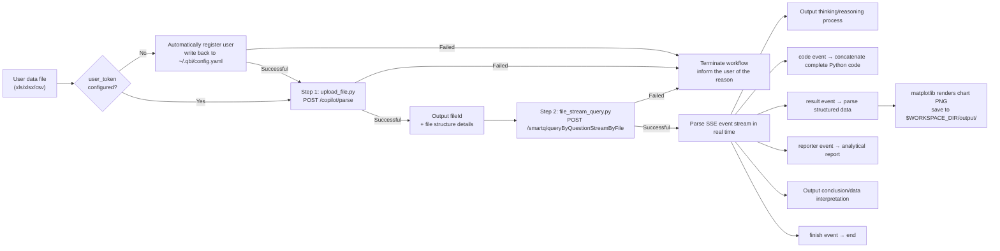

# File-Based Chat-to-Data Module

> For configuration instructions, see the "Configuration" section in the main file.

## Scope

**Does:**
- Performs natural-language analysis on Excel/CSV files uploaded by the user through the Quick BI API (file-based chat-to-data)
- Renders matplotlib charts and outputs visualization results and analytical conclusions

**Does NOT:**
- In chat-to-data scenarios, directly read files for local analysis using libraries such as pandas/openpyxl/csv
- When a file is rejected for exceeding the 5MB limit, do NOT attempt any local preprocessing (e.g. pandas filtering, splitting, compression, trimming) to bypass the limit

## Skill Triggering and Mode Selection

**Mode selection principle**: The Agent MUST first check whether the user has uploaded a file. If a file exists, enter file-based chat-to-data; if no file is uploaded, enter dataset-based chat-to-data (see `module-chat-dataset.md`). **The two modes are mutually exclusive.**

### Trigger Condition
- The user **MUST have uploaded** an Excel/CSV file (xls/xlsx/csv format, ≤ 5MB) AND asks questions about the data → **file-based chat-to-data**
- **MUST NOT enter this mode** if the user has not uploaded any file, even if they use trigger phrases like "analyze this data" or "file-based chat-to-data"
- Example trigger phrases (only when a file is present):
  - "Help me analyze this data"
  - "Query the TOP 10 with the highest xx"
  - "Query the TOP 10 with the highest xx"
  - "Compare sales by department"
  - "Analyze this file"
  - "File-based chat-to-data"
- **Execution method**: Strictly follow the two-script process (upload_file.py → file_stream_query.py). MUST NOT read or analyze the file in any other way.

## Prerequisites

- Required Python dependencies: `pip install requests pyyaml matplotlib numpy`
- File-based chat-to-data: supported file formats are limited to `xls`, `xlsx`, and `csv`, with a single-file size ≤ 5MB

---

## Workflow

Performs intelligent analysis through the streaming chat-to-data API based on structured Excel/CSV data files uploaded by the user.

Strictly execute in two steps. Each step runs independently and outputs complete results. The output of Step 1 (`fileId`) is used as the input of Step 2.

**Error-handling principle**: Business logic errors (insufficient permissions, trial expired, unsupported format, etc.) **MUST immediately terminate the entire workflow**. Transient network errors (timeout, connection interruption) may be retried 1–2 times (exponential backoff recommended). If retries still fail, terminate the workflow.



> **Output path convention**: Final chart PNG files are saved to `$WORKSPACE_DIR/output/`; intermediate files from `code` and `html` events are saved to `$WORKSPACE_DIR/.qbi/smartq-chat/output/`. The Agent only needs to care about the final PNG path in `$WORKSPACE_DIR/output/`.

> **⚠️ 5MB Exceeded — Immediate Termination Rule**: If Step 1 (upload file) fails due to the file exceeding 5MB, **immediately terminate the entire workflow**. Relay the upgrade prompt from the script output **verbatim to the user** (including the upgrade link). Do **NOT** proceed to Step 2, and do **NOT** attempt to locally process the file and re-upload (e.g. pandas filtering, splitting, compression, trimming).

### Step 1 — Upload File to Obtain fileId

```bash
python3 scripts/chat/upload_file.py /path/to/data.xlsx --workspace-dir '<workspace_dir>'
```

| Item | Description |
|------|------|
| API | `POST /openapi/v2/copilot/parse` |
| Content-Type | `multipart/form-data` |
| Function | Upload the file and parse structure details of each sheet |

#### Request Parameters

| Parameter | Type | Description |
|------|------|------|
| `file` | File | Uploaded data file (multipart file field) |
| `fileName` | String | File name (e.g., `sales_data.xlsx`) |
| `tableConfigs[0].tableName` | String | Table name (defaults to the filename without extension) |
| `tableConfigs[0].tableType` | String | `excel` or `csv` |
| `isSave` | String | Fixed as `false` |
| `fileId` | String | Leave blank (first upload) |

#### Output Content

The script outputs: upload progress prompts, `fileId`, and the complete response JSON (including file structure details, column names, and types for each sheet).

> **Key output**: Extract the `fileId` value from the output and use it as the first argument in Step 2.

#### Error Handling

If any of the following occurs in Step 1, **immediately terminate the entire workflow and MUST NOT continue to Step 2**:
- Automatic user registration fails
- File upload fails (unsupported format, size exceeds the limit, server-side parsing error)
- The script exits with a non-zero exit code

> **Critical constraint when the file exceeds the limit**: When a file exceeds the 5MB limit, the script outputs an upgrade prompt message. The Agent **MUST present this message to the user as-is** (including the upgrade link). **MUST NOT** bypass the 5MB limit by processing the file locally (e.g., filtering, splitting, compressing, etc.), and **MUST NOT** attempt to read or analyze the oversized file in any other way.

> **Expected wait time**: File-based chat-to-data usually takes 15–60 seconds, and complex analysis may take several minutes (up to a 10-minute timeout). It is recommended to inform the user in advance to wait patiently.

### Step 2 — Start Streaming Chat-to-Data Based on fileId

```bash
python3 scripts/chat/file_stream_query.py <fileId> "User question" --locale <locale> --workspace-dir '<workspace_dir>'
```

Example:

```bash
python3 scripts/chat/file_stream_query.py "abc123-def456" "Compare sales amounts across departments" --locale en_US --workspace-dir '<workspace_dir>'
```

| Item | Description |
|------|------|
| API | `POST /openapi/v2/smartq/queryByQuestionStreamByFile` |
| Content-Type | `application/json` |
| Response format | SSE (Server-Sent Events) event stream |
| Timeout | 10 minutes (600 seconds) |

#### Core SSE Event Types

| Event Type | Output Marker | Processing Method |
|----------|----------|----------|
| `text` | (direct output) | Concatenate and output text in real time |
| `reasoning` | (direct output) | Output AI thinking and reasoning process in real time |
| `code` | (silently collected) | Silently concatenate → save to `$WORKSPACE_DIR/.qbi/smartq-chat/output/` after the stream ends (intermediate file, not shown to user) |
| `result` | `[Data Retrieval Result]` | Parse structured data → render chart PNG with matplotlib |
| `reporter` | (direct output) | Concatenate analytical report text in real time |
| `html` | `[HTML Chart]` | Only save raw HTML to `$WORKSPACE_DIR/.qbi/smartq-chat/output/` (intermediate file, not shown to user) |
| `html_result` | `[Chart Data]` | Parse structured data and render chart |
| `sql` | `[SQL]` | Output generated SQL statement |
| `conclusion` | `[Conclusion]` | Output final analytical conclusion |
| `summary` | `[Data Interpretation]` | Output data interpretation analysis |
| `trace` | `[Trace]` | Request trace ID. Providing this ID when reporting an issue can speed up troubleshooting |
| `finish` | `[Done]` | Marks the end of the event stream (terminal event) |
| `error` | `[Error]` | Output error information (terminal event) |

### Display Rules

> Not all file-based chat-to-data results generate chart images. The script automatically chooses to output **images** or **Markdown tables** based on rendering conditions. The Agent should reply based on the script's actual output format.

#### When Images Are Present (Mandatory)

> **MUST**: When the script output contains `` image references, the Agent's reply **MUST include the Markdown image syntax verbatim**, otherwise the user cannot see the chart. This is a hard requirement and MUST NOT be omitted.

1. **Copy verbatim** the `` into the reply body
2. Immediately below the image, annotate the chart file path
3. **MUST NOT** add mechanical lead-in text above the chart
4. If there are multiple charts, display them inline one by one in order
5. **Single-response, chart-first principle**: The Agent MUST wait until the script execution is fully complete (including chart rendering) before composing the reply. All content — charts, conclusions, and data interpretation — MUST be delivered together in a single response. Specifically:
   - ❌ MUST NOT output conclusions or analytical text before the chart is ready
   - ❌ MUST NOT split the reply into multiple responses (e.g., text first, then chart via a separate tool call)
   - ❌ MUST NOT call any file-presentation tools (such as `present`, `showFile`, or similar) to deliver chart files separately — the Markdown image syntax `` is the sole delivery mechanism
   - ✅ Wait for the script to finish, then compose ONE complete reply containing: chart image(s) → conclusions → data interpretation
6. **MUST NOT read chart image files**: The Agent MUST NOT use `Read` or any file-reading/presentation tool (`showFile`, `present`, etc.) to view the generated chart PNG files. **This is critical**: when you read a chart image, the system feeds the image content back to you, which creates a false impression that you have already "delivered" the chart to the user. In reality, you have only looked at the chart yourself — the user still needs to see it via the `` markdown syntax in your reply text. The script's text output (conclusions, data interpretation, etc.) already contains all information needed to compose the reply. The Agent's sole responsibility is to copy the `` references verbatim from the script output.
7. **Pre-delivery self-check**: Before finalizing the reply, the Agent MUST verify that every `` image reference from the script output appears in the reply body. If the script output contained image references but the draft reply does not, the reply MUST be corrected before sending.

#### When No Images Are Present

1. If the script outputs a Markdown table, display the table directly
2. If matplotlib is unavailable, output a Markdown table based on the `result` event data
3. If there are neither images nor tables, compose a reply based on `conclusion` / `summary` / `reporter` content
4. **MUST NOT** fabricate `` image syntax or placeholder tables when no image output exists

### Result Summary Requirements

When replying to the user, the Agent MUST satisfy both of the following:

1. **Inline charts (priority)**: If the script output contains `` image references, **MUST copy them verbatim** into the reply body first (see "Display Rules › When Images Are Present" above), ensuring the user can see the visualization results
2. **Text summary**: Based on the `conclusion` and `summary` content in the script output, combined with the `reporter` (analytical report) text, **reorganize and summarize** the analytical results

Displaying analysis code or code file paths to the user is **prohibited** (see Important Notes item 9 for details).

---

## Reply Composition Rules (MUST READ — Most Common Violation)

> ⚠️ **The following rules have the highest priority. Extensive testing shows that the Agent tends to "peek" at generated files (Read PNG / Read JSON) after script execution, causing images to be lost in the final reply. These rules are designed to prevent this behavior.**

### Forbidden Actions (Strictly Prohibited)

1. **MUST NOT read chart PNG files with any tool** — Do NOT use `Read`, `showFile`, `present`, or any file-reading tool on `.png` files in `$WORKSPACE_DIR/output/`. The Agent is a text-based assistant; reading an image gives you a false sense of having "delivered" the chart, and you will forget to include the `` syntax.
2. **MUST NOT read the query result JSON to compose the reply** — The JSON file at `$WORKSPACE_DIR/.qbi/smartq-chat/output/query_result_*.json` is for logging only. All information needed for the reply is already in the script's console output.
3. **MUST NOT describe the chart in words as a substitute for the image** — Even if you "saw" the chart via Read, you MUST still include the `` syntax. The user needs to see the actual rendered chart, not a text description.

### Required Actions

1. **The script's console output is the ONLY source of truth** — After `file_stream_query.py` finishes, look at what it printed to stdout. That output contains:
   - `` image references → copy these verbatim into your reply
   - `[Conclusion]` text → use in your text summary
   - `[Data Interpretation]` text → use in your text summary
   - Reporter/analysis text → use in your text summary
2. **Single-response delivery** — Wait until the script execution is fully complete, then compose ONE reply containing: chart image(s) → text summary. Do NOT split into multiple messages.
3. **Pre-send checklist** — Before sending your reply, verify ALL of the following:
   - [ ] Does the script output contain `` image references?
   - [ ] If YES → does my draft reply contain every single one of those `` references verbatim?
   - [ ] Have I NOT called any Read/file tool on `.png` or `query_result_*.json` files?
   - [ ] Is this a single, complete reply (not split across multiple messages)?

### Concrete Example: Wrong vs Correct

**Scenario**: The script finishes with the following relevant output:
```
[Chart] Generated → /Users/user/Downloads/output/chart_123_1.png

[Conclusion] Total sales amount is 5.123 billion.
```

❌ **WRONG** (what actually happened in a real case):
```
Agent reads the PNG file with Read tool → sees the chart image
Agent reads the JSON file with Read tool → sees the data
Agent replies: "Based on the analysis results, the total sales amount of this data file is 5.123 billion..."
  (NO  — the chart image is completely missing!)
```

✅ **CORRECT**:
```
Agent does NOT read any files.
Agent composes reply directly from script output:

Based on the analysis results, the total sales amount is 5.123 billion，
data sourced from the order_amt field.


```

---

## Exception Handling (Must Read)

The scripts have built-in detection logic for the following exception types and automatically print the corresponding prompts in the console. The Agent should refer to the prompt copy in `../common/error_messages.md` when communicating with the user. The wording may be adjusted appropriately based on context, but the core information (links and suggested actions) MUST NOT be omitted. Once any exception is detected, **immediately terminate the workflow**.

### 1. Trial Expired

**Trigger condition**: Error code `AE0579100004` appears in the script output or API response of any step
**Detection location**: `check_trial_expired()` in `scripts/common/utils.py`
**Handling method**: Inform the user that the trial has expired and guide them to activate the formal service. See the detailed prompt copy in [error_messages.md](../common/error_messages.md)

### 2. Data File Parsing Failed

**Trigger condition**: In file-based chat-to-data mode, the script output contains "Data file parsing failed"
**Detection location**: `_on_error` method in `scripts/chat/file_stream_query.py`
**Handling method**: Instruct the user to check the file format and content, then try again. See the detailed prompt copy in [error_messages.md](../common/error_messages.md)

---

## Key API Summary

| API | Method | Content-Type | Description |
|------|------|-------------|------|
| `/openapi/v2/copilot/parse` | POST | multipart/form-data | Upload file and parse structure, returns fileId |
| `/openapi/v2/smartq/queryByQuestionStreamByFile` | POST | application/json | File-based streaming chat-to-data API (SSE) |
| `/openapi/v2/organization/user/queryByAccount` | GET | - | Query whether a user is in the organization by accountName |
| `/openapi/v2/organization/user/addSuer` | POST | application/json | Add a user to the organization |

---

## Important Notes

1. **File-based chat-to-data MUST use the API**: It is prohibited to directly analyze user-uploaded files using libraries such as pandas/openpyxl
2. **Mode selection**: Automatically select dataset-based chat-to-data or file-based chat-to-data mode based on whether the user uploaded a file
3. **File-based chat-to-data MUST be executed step by step**: First execute Step 1 to upload the file and obtain `fileId`, then execute Step 2 with `fileId` to perform chat-to-data. MUST NOT skip or merge steps
4. **Error handling**: Business logic errors (insufficient permissions, trial expired, etc.) MUST immediately terminate the entire workflow; transient network errors (timeout, connection interruption) may be retried 1–2 times before termination. Clearly explain the reason for the error to the user and remind them: "If you need further help, please contact the Quick BI product service team for support."
5. **Streaming timeout**: The default timeout is 10 minutes (600 seconds). Complex queries may take a relatively long time
6. **File format restrictions**: ONLY `xls`, `xlsx`, and `csv` formats are supported, and a single file MUST NOT exceed 5MB
7. **Automatic userId handling**: When `user_token` is not configured, the script automatically generates an accountId based on a unique device identifier at startup, checks and registers the user through the organization user API, and writes the userId back to the global config `~/.qbi/config.yaml` after successful registration. Subsequent calls will not repeat the registration
8. **Chart display (mandatory)**: PNG files are saved in the `$WORKSPACE_DIR/output/` directory, and the script outputs them in `` format. The Agent **MUST** copy the `` from the script output verbatim into the reply. This is the ONLY way the user can see charts and MUST NOT be omitted
9. **MUST NOT display code**: In file-based chat-to-data, the Python code from the `code` event is ONLY saved silently. Displaying the code content or code file path in the reply is **prohibited**
10. **MUST NOT fabricate placeholder tables**: The Agent is **prohibited** from constructing Markdown tables containing placeholders such as "(data shown in chart below)" or other empty-shell tables
11. **Data value and unit consistency rule (mandatory)**: The API may return data with unit conversions applied (e.g., the raw data is in "yuan" but the API result displays "wan yuan (10k)", or raw data is in grams but displayed as "kilograms"). The Agent **MUST check unit consistency** across all data sources (table headers, chart labels, `[Conclusion]`, `[Data Interpretation]`, etc.) and **unify units when inconsistencies are detected**.
    - ✅ **Check first**: Before writing the textual summary, examine whether the table/chart header specifies a unit (e.g., "Sales Amount"), and compare it with the units used in `[Conclusion]` / `[Data Interpretation]` text
    - ✅ **Unify when inconsistent**: If the header says "wan yuan (10k)" but the conclusion text uses raw values in "yuan" (or vice versa), convert the values so that the entire reply uses **one single, consistent unit** — preferring the unit shown in the table/chart header as the canonical unit
    - ✅ **Preserve when consistent**: If all sources already use the same unit, use the values and units as-is without any conversion
    - ❌ MUST NOT mix different units in the same reply (e.g., table shows "wan yuan (10k)" while the text summary uses "yuan")
    - ❌ MUST NOT fabricate or guess units that do not appear in any output source
    - ❌ MUST NOT claim the API result is wrong when it uses a different unit granularity than the raw data — the API is authoritative for its own output
12. **Single-response delivery (mandatory)**: The Agent MUST NOT deliver partial results (e.g., conclusions without charts) before the script finishes execution. Wait for the complete script output (including chart rendering), then deliver all content — images, conclusions, and data interpretation — in a single, unified response. Calling file-presentation tools (e.g. `present`) to separately deliver charts is prohibited; the Markdown image syntax is the only chart delivery mechanism.
13. **MUST NOT read chart PNG files**: The Agent MUST NOT use `Read`, `showFile`, `present`, or any file-reading/presentation tool on chart PNG files. Reading the image gives the Agent a false sense of having "delivered" the chart, causing it to omit `` from the reply. The script's text output already provides all necessary data. **This is the #1 most common cause of missing charts in user replies.**
14. **MUST NOT read the query result JSON to compose replies**: The `query_result_*.json` file is for logging/debugging only. All data needed for the reply (conclusions, summaries, image paths) is already in the script's stdout. Reading the JSON and then composing a reply from scratch will lead to missing the `` image syntax.
15. **Pre-delivery self-check (mandatory)**: Before sending the reply, the Agent MUST verify that every `` image reference present in the script output is also present in the reply body. Missing any image reference is a critical error.

---

## Examples

**Example 1a: File-Based Chat-to-Data (English)**

Input:
```
User: uploaded sales_data.xlsx and asks, "Compare sales amounts across departments"
```

Expected:
```bash
# Step 1: Upload the file to obtain fileId
python3 scripts/chat/upload_file.py /path/to/sales_data.xlsx --workspace-dir '<workspace_dir>'
# Output fileId=abc123-def456

# Step 2: Start chat-to-data based on fileId
python3 scripts/chat/file_stream_query.py "abc123-def456" "Compare sales amounts across departments" --locale en_US --workspace-dir '<workspace_dir>'
```

**Example 1b: File-Based Chat-to-Data**

Input:
```
User: uploaded sales_data.xlsx and asks, "Compare sales by department"
```

Expected:
```bash
# Step 1: Upload file to get fileId
python3 scripts/chat/upload_file.py /path/to/sales_data.xlsx --workspace-dir '<workspace_dir>'
# Output fileId=abc123-def456

# Step 2: Start chat-to-data based on fileId
python3 scripts/chat/file_stream_query.py "abc123-def456" "Compare sales by department" --locale zh_CN --workspace-dir '<workspace_dir>'
```

Execute in two steps. The Agent summarizes the analytical results based on the conclusion and data interpretation. If the script outputs `` images, **MUST copy them verbatim into the reply**; if the output is a Markdown table, display it directly; if no chart data is present, reply based on the conclusion text. MUST NOT display code.
