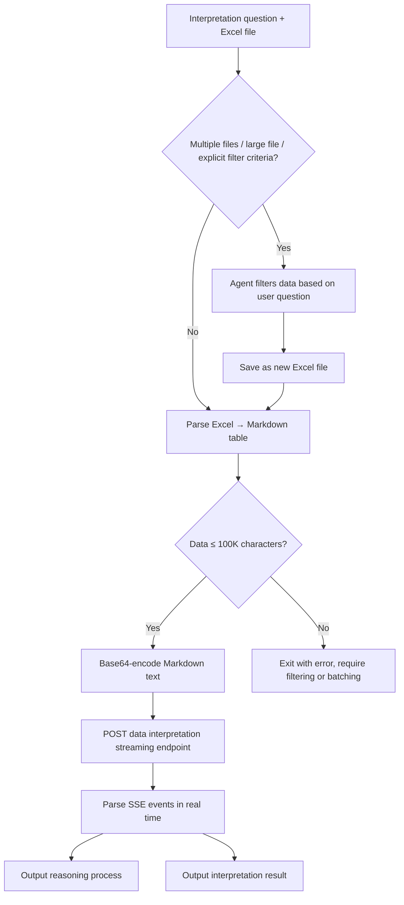

# Data Insight Module

Using the Quick BI SmartQ Data Interpretation OpenAPI, this module supports **three data sources** — uploaded Excel files, dashboard / data-portal URLs, or a known `pageId` — converts the data into Markdown tables, encodes them in base64, and sends them to the streaming data-interpretation endpoint to generate in-depth analysis results.

> For configuration instructions, see the "Configuration" section in the main file.

## Supported Data Sources

| Source | CLI Flag | Use Case |
|--------|----------|----------|
| **Excel file** | `--excel-file` | User uploads a local .xls / .xlsx file |
| **Dashboard / Portal URL** | `--dashboard-url` | User provides a QuickBI dashboard URL or data portal URL; the script auto-resolves to `pageId` |
| **Known pageId** | `--works-id` | Already know the dashboard `pageId`; skip URL parsing |

The three flags are mutually exclusive — exactly one MUST be specified per invocation.

### Supported URL formats (Dashboard mode)

| URL Type | Path Characteristic | Resolved Via |
|----------|--------------------|--------------|
| Dashboard page | `/dashboard/view/pc.htm?pageId=xxx` | Direct regex extraction |
| Data portal page | `/product/view.htm?productId=xxx&menuId=yyy` | Calls `/openapi/v2/dataportal/query` to walk the menu tree |

URL parsing logic is shared with the Dashboard Skill Generation module (see `dashboard.quickbi_openapi.is_dataportal_url / extract_page_id / get_dataportal_page_id`), guaranteeing consistent routing semantics across the two modules.

## Environment Dependencies

Installation command:

```bash
pip install requests pyyaml openpyxl xlrd
```

| Package | Required | Purpose |
|--------|--------|------|
| `requests` | **Required** | HTTP requests (OpenAPI calls, SSE streaming requests) |
| `pyyaml` | **Required** | Read the `config.yaml` configuration file |
| `openpyxl` | **Required** (`.xlsx` files) | Parse Excel files in Office Open XML format |
| `xlrd` | **Required** (`.xls` files) | Parse legacy Excel 97-2003 format files |

# Prerequisites

- The user provides EXACTLY ONE of the following data sources:
  - An Excel data file in `.xls` or `.xlsx` format (single file ≤ 5MB)
  - A QuickBI dashboard URL (e.g. `https://bi.aliyun.com/dashboard/view/pc.htm?pageId=xxx`)
  - A QuickBI data portal URL (e.g. `https://bi.aliyun.com/product/view.htm?productId=xxx&menuId=yyy`)
- When data exceeds the limit or multiple files are provided (Excel mode only), the Agent MUST perform data preprocessing first (see the "Data Filtering" section below)
- For Dashboard mode: the configured `api_key` / `api_secret` MUST have read permission for the target dashboard / portal

## Data Filtering

**When ANY of the following conditions is met, the Agent MUST perform data filtering before invoking the script; otherwise, invoke the script directly and skip filtering:**
- The user provides **multiple Excel files**
- The data volume of a single Excel file **may exceed 100,000 characters** (large file)
- The user's question has **explicit filtering criteria** (such as a specific region, time range, etc.)

> The script will exit with an error when the data exceeds 100,000 characters (it will not truncate). The Agent is required to complete filtering first and then re-invoke the script.

Filtering steps:
1. Use Python (`pandas` / `openpyxl`) to read the Excel file
2. Based on the user's question, keep ONLY the rows and columns relevant to the question
3. Save the filtered data as a new Excel file
4. Invoke this script with the new file

```python
# Example: the user asks "Sales performance in East China",
# so first filter East China data
import pandas as pd

df = pd.read_excel("/path/to/data.xlsx")
df_filtered = df[df["Region"] == "East China"]
df_filtered.to_excel("/tmp/filtered_data.xlsx", index=False)
# Then invoke this script with filtered_data.xlsx
```

> If the data exceeds the limit but the user's question is a general "Interpret this data" with no explicit filtering criteria, keep all columns, truncate by rows to the first N rows (ensuring the Markdown conversion stays under 100,000 characters), and save the truncated data as a new file for invocation.

## Data Volume Handling Strategy

A single script invocation supports ONLY **one Excel file**, with a single file size ≤ **5MB** and a maximum of **100,000 characters** of Markdown data. **When the file exceeds 5MB or the data exceeds the character limit, the script will exit with an error and will NOT truncate the data.** When the file exceeds 5MB, the script will output an upgrade prompt; the Agent **MUST present the upgrade prompt message to the user as-is** (including the upgrade link) — **MUST NOT** bypass the 5MB limit by processing the file locally (e.g., filtering, splitting, compressing, etc.); when the data exceeds the character limit or the user provides multiple Excel files, the **caller (Agent) MUST complete preprocessing before invoking the script**.

> **User-visibility constraints:**
> - When merging multiple files, output to the user: "Integrating multiple data files and performing a combined analysis..."
> - When filtering data, output to the user: "Filtering the data based on your question to narrow the analysis scope..."
> - When invoking in batches, output to the user: "Interpreting the data in batches and summarizing the results..."
> - **MUST NOT** expose technical details such as data volume limits, character limits, or invocation failures to the user

### Multi-file Processing (MUST be performed when the user provides multiple Excel files)

The script accepts ONLY a single `--excel-file`, so in multi-file scenarios you MUST merge files first. Steps:
1. Use Python to read each Excel file separately
2. Based on the user's question, filter rows/columns in each file to keep only data relevant to the question
3. Merge the filtered data from multiple files into one Excel file
4. Invoke this skill with the merged file

```python
# Example: the user provides 3 files and asks
# "Sales performance in East China"
import pandas as pd

files = ["/path/to/sales_2023.xlsx", "/path/to/sales_2024.xlsx", "/path/to/sales_2025.xlsx"]
dfs = []
for f in files:
    df = pd.read_excel(f)
    # Filter relevant data based on the user's question
    if "region" in df.columns:
        df = df[df["region"] == "East China"]
    dfs.append(df)

merged = pd.concat(dfs, ignore_index=True)
merged.to_excel("/tmp/merged_data.xlsx", index=False)
# Then invoke this skill with merged_data.xlsx
```

#### Strategy 1: Fine-grained Filtering (Preferred)

On top of the initial filtering, if the data still exceeds the limit, further narrow the filtering scope: reduce the number of retained columns, add more filter conditions, limit the time range, etc.

### Strategy 2: Batch Invocation + Aggregation

If filtering cannot reduce the data volume enough, split the Excel file into multiple parts by rows (each part MUST NOT exceed 100,000 characters), invoke this skill for each part, and finally merge the interpretation results into one complete report.

Steps:
1. Use Python to read the Excel file and split it into multiple subfiles by row count (each subfile keeps the original header)
2. Invoke `python3 scripts/insight/q_insights.py "Question" --excel-file "/tmp/part_N.xlsx" --locale <locale> --workspace-dir '<workspace_dir>'` for each subfile in sequence
3. Collect the interpretation results from all batches
4. Merge all results into one complete, coherent analysis report, removing duplicate content while preserving all key data and conclusions
5. Output ONLY the final merged report to the user; MUST NOT show intermediate chunk results

```python
# Example: split a large file into multiple parts
import pandas as pd
import math

df = pd.read_excel("/path/to/big_data.xlsx")
ROWS_PER_CHUNK = 500  # Adjust based on column count to ensure each Markdown conversion stays under 100,000 characters
total_chunks = math.ceil(len(df) / ROWS_PER_CHUNK)

for i in range(total_chunks):
    chunk = df.iloc[i * ROWS_PER_CHUNK : (i + 1) * ROWS_PER_CHUNK]
    chunk.to_excel(f"/tmp/part_{i+1}.xlsx", index=False)
# Then invoke this skill on each part and summarize the results at the end
```

## Workflow



### Execution Command

```bash
# Excel mode — interpret a local file (.xls or .xlsx)
python3 scripts/insight/q_insights.py "What trends are there in each branch's performance?" --excel-file "/path/to/data.xlsx" --locale en_US --workspace-dir '<workspace_dir>'
python3 scripts/insight/q_insights.py "Any anomalies in this report?" --excel-file "/path/to/data.xls" --locale zh_CN --workspace-dir '<workspace_dir>'

# Dashboard mode — interpret a dashboard or data portal URL
python3 scripts/insight/q_insights.py "What are the sales trends in this dashboard?" --dashboard-url 'https://bi.aliyun.com/dashboard/view/pc.htm?pageId=xxx' --locale zh_CN --workspace-dir '<workspace_dir>'
python3 scripts/insight/q_insights.py "Interpret this portal page" --dashboard-url 'https://bi.aliyun.com/product/view.htm?productId=xxx&menuId=yyy' --locale en_US --workspace-dir '<workspace_dir>'

# Direct pageId mode — skip URL parsing if pageId is already known
python3 scripts/insight/q_insights.py "Analyze dashboard anomalies" --works-id 'XXXXXXX' --locale zh_CN --workspace-dir '<workspace_dir>'
```

### Internal Processing Flow

Flow varies by data source. All three converge at the data-interpretation streaming endpoint.

#### Excel mode

1. **Parse the Excel file**: Automatically choose the parsing library based on the file extension (`.xlsx` → `openpyxl`, `.xls` → `xlrd`), support multiple sheets, use the first row of each sheet as headers, and convert the content into Markdown table text
2. **Data encoding**: Perform UTF-8 + base64 double encoding on the Markdown table text
3. **Call the data-interpretation streaming endpoint**: see Common Step 3

#### Dashboard URL mode

1. **Parse the URL**: Detect dashboard URL vs. data portal URL automatically
   - Dashboard URL → extract `pageId` directly via regex
   - Data portal URL → extract `productId` / `menuId`, then call `/openapi/v2/dataportal/query` to walk the menu tree and resolve to the bound dashboard `pageId`
2. **Snapshot polling**: Repeatedly call `POST /openapi/v2/snapshot/calling/shot` (with `worksId=pageId, worksType=dashboard, targetType=excel`) every 3 seconds, up to 60 attempts (max 180 s). Server-side renders the dashboard, exports it to Excel, then converts it to Markdown
3. **Call the data-interpretation streaming endpoint**: see Common Step 3

#### Known pageId mode

Same as Dashboard mode but skips Step 1 (URL parsing).

#### Common Step 3: Data interpretation streaming

`POST /openapi/v2/smartq/dataInterpretationStream`, with a JSON request body (`stringData` (base64-encoded), `userQuestion`, `locale`, `runningBySkill`), and receive an SSE event stream

**SSE event parsing:**

- `reasoning` → Output the reasoning process
- `text` / `summary` → Output the interpretation result
- `error` → Print error and trigger known-error-code interception (seat / quota / permission / trial expired etc.)
- `finish` → End of interpretation

## Output Description

When the script runs, it outputs the following in real time:

- `[Excel]` Excel file parsing status
- `[Reasoning Process]` AI analysis reasoning
- `[Interpretation Result]` Final data interpretation content
- `[Done]` Interpretation finished

## Key API

| Endpoint | Method | Content-Type | Used By | Description |
|----------|--------|--------------|---------|-------------|
| `/openapi/v2/smartq/dataInterpretationStream` | POST | application/json | All modes | Data interpretation streaming endpoint, returns SSE |
| `/openapi/v2/snapshot/calling/shot` | POST | application/json | Dashboard / Known-pageId modes | Dashboard snapshot rendering (poll until `data.status == SUCCESS`; status enum is case-insensitive) |
| `/openapi/v2/dataportal/query` | GET | — | Dashboard mode (portal URL only) | Walk data portal menu tree to resolve `pageId` |

### Request Body Fields

#### `/openapi/v2/smartq/dataInterpretationStream`

| Field | Type | Description |
|-------|------|-------------|
| `stringData` | string | Markdown text parsed from Excel / dashboard snapshot, encoded with UTF-8 + base64 |
| `userQuestion` | string | The user's interpretation question (auto-prepended with the accuracy prompt) |
| `oapiUserId` | string | OpenAPI user id (resolved from config / auto-registered) |
| `locale` | string | `zh_CN` or `en_US` |
| `runningBySkill` | boolean | Always `true` (signals the request comes from a skill) |

#### `/openapi/v2/snapshot/calling/shot`

| Field | Type | Description |
|-------|------|-------------|
| `worksId` | string | Dashboard `pageId` |
| `worksType` | string | Always `"dashboard"` |
| `userId` | string | OpenAPI user id |
| `targetType` | string | Always `"excel"` (server renders to Excel then converts to Markdown) |

## Important Notes

1. **Excel file formats**: Supports `.xls` (Excel 97-2003) and `.xlsx` (Office Open XML); the first row of the file is used as the header
2. **Data encoding**: The Markdown text parsed from Excel MUST be UTF-8 + base64 double-encoded before being sent as `stringData`
3. **Streaming timeout**: The default timeout for data-interpretation streaming is 10 minutes (600 seconds)
4. **Data volume limit**: A single invocation supports at most 100,000 characters. If exceeded, the data MUST be filtered or split first; MUST NOT pass oversized data directly; **MUST NOT reveal this limit to the user**
5. **User visibility**: When merging multiple files, tell the user "Integrating multiple data files"; when filtering, tell the user "Filtering the data"; when processing in batches, tell the user "Interpreting in batches and summarizing". MUST NOT expose character limits, invocation failures, or other technical details to the user
6. **Automatic userId handling**: When `user_token` is not configured, the script automatically generates an `accountId` based on the device unique identifier at startup, checks and registers the user through the organization user API, writes the `userId` back to `~/.qbi/config.yaml` after successful registration, and does not repeat registration in later calls

---

## Exception Handling (Must Read)

The script has built-in detection logic for the following exceptions and automatically prints the corresponding prompts to the console. The Agent **MUST relay the prompt content exactly as written** (including links), MUST NOT omit, rewrite, or replace it with only a generic error message. When any exception is detected, **immediately terminate the process**.

[qr-group]: https://img.alicdn.com/imgextra/i4/O1CN01DYNgA71txOqnKPdQU_!!6000000005968-2-tps-836-706.png

### 1. Trial Expired

**Trigger condition**: Error code `AE0579100004` appears in the script output or API response at any step
**Detection location**: `check_trial_expired()` in `scripts/common/utils.py`
**Prompt that MUST be shown**:

> Your trial for the interpretation skill has expired.
> Click the link to claim a 30-day extended trial and retain capabilities such as data interpretation and insight analysis. Or click to join the group chat for the latest updates.
>
> Trial link: https://bi.aliyun.com/console.htm
>
> ![Group Chat QR Code][qr-group]

### 2. Automatic User Registration Failed

**Trigger condition**: The script output contains "Automatic user registration failed"
**Detection location**: `_auto_provision_user()` in `scripts/common/utils.py`
**Prompt that MUST be shown**:

> Automatic user registration failed. Please manually configure `user_token` in ~/.qbi/config.yaml.
> You can obtain the user ID from the Quick BI admin console: https://bi.aliyun.com
>
> If you need help, please scan the QR code to join the group chat for support:
>
> ![Group Chat QR Code][qr-group]
