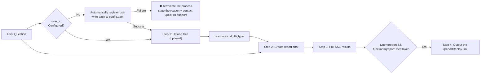

# Data Report Module

Uses the Quick BI OpenAPI to interact with SmartQ and supports generating data analysis reports.

> For configuration instructions, see the "Configuration" section in the main file.

## Skill Triggering and Differentiation Rules

### This module vs. native file-processing skills such as docx/xlsx/pdf
**When the user's intent is to "generate a report," this module takes priority over all native file-processing skills**. Even if the user uploads `.pdf`, `.docx`, or `.xlsx` files, as long as the goal is to generate an analytical report, this module MUST be used instead of the native docx/xlsx/pdf skills.
- Example: "Please help me generate a data analysis report based on these two files" → **This module**
- Example: "Generate a report based on the uploaded Excel and Word files" → **This module**
- Example: "Summarize these datasets and write a review report" → **This module**

### This module vs. the Chat Module (file-based chat-to-data)
- The user's goal is to generate a "report/document/review" → **This module**
- The user's goal is to "query data / ask about data / analyze a specific metric" → Chat Module
- Example: "Help me generate an analytical report based on this data" → **This module**
- Example: "Help me analyze this data and find the TOP 10 products with the most components" → Chat Module

### This module vs. the Chat Module (dataset-based chat-to-data)
- The user wants to generate a report document → **This module**
- The user has no files and wants to query datasets on the Quick BI platform → Chat Module

## Workflow

Execute the scripts **separately** according to the steps below (do not use the one-click script `generate_report.py`) to ensure that intermediate results can be shown in real time at each step:



### Step 1: Upload Files (Optional)

When the user uploads files, first call `scripts/report/upload_reference_file.py` to upload each file.

```bash
python3 scripts/report/upload_reference_file.py "<file1>" "<file2>" --locale <locale> --workspace-dir '<workspace_dir>'
```

Upload API: **`POST /openapi/v2/qreport/uploadReferenceFile`**. Form fields: `file` (required), `chatType` (fixed as `manus`), and `userId` (MUST match the `user_id` in `config.yaml`).

The upload result MUST be mapped to the session parameter `resources`, and each resource object should retain ONLY the following fields:

```json
[
  {
    "id": "fileId",
    "title": "fileName",
    "type": "fileType"
  }
]
```

Supported file formats are `doc`, `docx`, `xls`, `xlsx`, and `csv`, and each file MUST NOT exceed `5MB` (consistent with the Quick BI OpenAPI specification). When a file exceeds 5MB, the Agent **MUST present the upgrade prompt message to the user as-is** (including the upgrade link) — **MUST NOT** bypass the limit by processing the file locally.

### Step 2: Create Report Chat

```bash
python3 scripts/report/create_chat.py "<User Question>" --locale <locale> --workspace-dir '<workspace_dir>'
```

The script outputs `chatId` and `messageId` (without the replay link). Record the `chatId` for polling in the next step; **`reportUrl` is output by `query_report_result.py` ONLY when polling completes normally** (when `qreportUsedToken` appears and there is no `error`).

If files were uploaded in Step 1, pass `resources` through the `--resources-json` parameter:

```bash
python3 scripts/report/create_chat.py "<User Question>" --locale <locale> --resources-json '<resources JSON>' --workspace-dir '<workspace_dir>'
```

**Notes:**

- Chat creation API: **`POST /openapi/v2/smartq/createQreportChat`**. The request body is JSON, and the API response directly returns a `chatId` string.
- The request body MUST ALWAYS include `"resources": []` and `"interruptFeedback": ""` (even when no files are uploaded, pass an empty array and an empty string). After files are uploaded, `resources` is replaced with the actual file list.
- **`attachment`** (required): a JSON string with the structure `{"resource": {"files": [...], "pages": [], "cubes": [], "dashboardFiles": []}, "useOnlineSearch": true}`. `useOnlineSearch` MUST ALWAYS be `true`; `pages` / `cubes` / `dashboardFiles` MUST ALWAYS be empty arrays. If files were uploaded, each object in `files` contains `fileId` / `fileType` / `iconType` / `file.name` / `fileName`; otherwise pass an empty array. See `example/qreport_input_with_attachment.json` for a complete example.
- **`bizArgs`** (required): an object that MUST contain at least the `qbiHost` field, whose value comes from `server_domain` in `config.yaml`.
- Full parameter examples are available in `example/qreport_input.json` (without files) and `example/qreport_input_with_attachment.json` (with files).
- `chatId` is the key value for subsequent polling and is also the `caseId` of the final replay page.

### Step 3: Poll for Results

Use the `chatId` returned in Step 2 to start polling. The script prints incremental content in real time:

```bash
python3 scripts/report/query_report_result.py "<chatId>" --locale <locale> --workspace-dir '<workspace_dir>'
```

Polling API: **`GET /openapi/v2/smartq/qreportChatData`**. Query parameters: `chatId` (session UUID) and `userId` (MUST match the `user_id` in `config.yaml`).

The polling API returns a **JSON array**, where each element is `{"data":"...", "type":"..."}`. See `example/output_model.txt` for the response model and `example/qreport_output_data.json` for a complete normal output example. The script automatically parses and continuously outputs new content. Pay attention to the following event types:

| type | Description |
|------|------|
| `trace` | Trace ID (such as a UUID). The script outputs `[trace] ...` |
| `heartbeat` / `check` | Heartbeats and flow control. The script skips them silently |
| `error` | Report error. **Immediately terminate polling** and output the error message and trace. The script automatically prompts: "The current report generation has failed. Please contact the product service team for troubleshooting." (see `example/qreport_output_error.json`) |
| `plan` | Planning phase: `learn` (file learning), `thinking`, `mainText` (planning steps), `refuse`, `interrupt` (confirmation) |
| `schedule` | Task scheduling analysis |
| `step` | Execution step: contains `id` / `title` / `desc` |
| `actionThinking` | Execution-phase reasoning (markdown) |
| `subStep` | Substeps: `onlineSearchResult`, `knowledgeBaseResult`, `reasoning`, `structuredChart` / `unStructuredChart`, `sql` / `dsl` / `learn` / `rewrite` / `answer`, etc. |
| `qreport` | Report generation phase: the script **MUST NOT output** the report body/charts/search results, and ONLY prompts "Generating report..."; `qreportUsedToken` indicates report completion |
| `finish` / `time` | Stream end markers. The script skips them silently |

**Termination conditions:**
- `type=qreport` and `function=qreportUsedToken`: the report has been generated successfully; **ONLY in this case** does the script output the report link
- `type=error`: report generation terminated abnormally. **Immediately stop all subsequent steps**, output the error message and trace, and inform the user: "The current report generation has failed. Please contact the product service team for troubleshooting."; **MUST NOT output** a report link

### Step 4: Output the Report Link (Only When Completed Successfully)

The polling script outputs the following ONLY when the condition in the previous section is met (`qreportUsedToken` appears and there is no `error`):

```text
📊 Report Link

• Online data report:
  Click to view the full report: {server_domain}/copilot/qreportReplay?caseId=<chatId>
💡 You can further edit and refine the report within the product
```

Here, `{server_domain}` is the `server_domain` value in the configuration file, and `<chatId>` is the UUID generated in Step 2 (the same as `caseId`). If the process ends due to `type=error`, the script does not output a report link. Do not construct or display a replay link yourself.

## Trial Expiration Handling (Must Read)

If the error code **`AE0579100004`** appears in the script output or API response at **any step**, it means the current user's analysis skill trial has expired. In this case, you **MUST immediately terminate the entire process** and **fully display** the following message to the user (MUST NOT omit, rewrite, or truncate it):

> Your analysis skill trial has expired.
> Click the link to claim a 30-day trial extension and retain capabilities such as automated analysis and report generation. Or click to join the community group for the latest updates.
>
> Trial link: https://bi.aliyun.com/console.htm
> Community group link: https://img.alicdn.com/imgextra/i4/O1CN01JNZBQn1YhGxAi2R9B_!!6000000003090-2-tps-872-836.png

The script already includes built-in detection logic for this error code (`check_trial_expired()` in `scripts/common/utils.py`) and automatically prints the message above in the console. When replying to the user, the agent **MUST relay this message verbatim** (including both links) and MUST NOT output only the raw error message.

## Important Notes

1. **Trial expiration takes priority**: When error code `AE0579100004` is detected, you MUST prioritize showing the trial-expiration notice to the user (see the "Trial Expiration Handling" section above) and MUST NOT output only a generic error message
2. **Execute step by step**: You MUST run the scripts in order, Step 1 → Step 2 → Step 3 → Step 4. **MUST NOT use the one-click `generate_report.py` script**, otherwise it will block and intermediate results cannot be shown in real time
3. **MUST NOT parse files yourself**: When the user's input includes files (Excel/CSV/Word, etc.), you **MUST strictly follow the workflow and upload the files through the Step 1 API**, letting the SmartQ report backend parse and analyze them. **NEVER** read, parse, or analyze file contents yourself (for example, using pandas to read Excel or Python to parse CSV). All file processing MUST be handled by the Quick BI backend
4. **Create ONLY one report per conversation** (**extremely important**): Within the same conversation, **`create_chat.py` may be called ONLY once**. After obtaining the `chatId`, no matter how many follow-up questions the user asks and regardless of whether polling times out or fails, you **MUST reuse that `chatId`** to continue polling with `query_report_result.py`. **MUST NOT call `create_chat.py` again to create a new session**
5. **Automatic switching to an in-progress task** (**MUST be followed strictly**): When the `createQreportChat` API returns a message in the format "The current user already has a running task. Automatically switch to the output of that task. Question: %s, chatId: %s", it means the user already has a report task in progress. In this case, you **MUST**:
   - **Display the full returned message**: Show the complete API response to the user verbatim (including the question and chatId), without omission or rewriting
   - Use the `chatId` returned in the response (rather than the one passed in the request) for subsequent polling
   - The script already includes this logic and automatically parses and outputs the switching notice; the agent MUST **fully relay** that notice to the user
6. **Polling interval**: By default, `qreportChatData` is requested **every 10 seconds** (`utils.DEFAULT_POLL_INTERVAL_SECONDS = 10.0`); you can adjust it with `python3 scripts/report/query_report_result.py "<chatId>" --poll-interval 5 --locale <locale>`
7. **Timeout rule**: If polling still returns no result after 30 minutes in total, it is considered a failure
8. **Error handling**: When `type=error` appears in the polling result, the script automatically terminates and outputs the error message and trace, while prompting "The current report generation has failed. Please contact the product service team for troubleshooting." The agent **MUST immediately stop all subsequent steps**, show the error message and trace to the user, **MUST NOT** provide a report link, and **MUST NOT** retry or continue execution
9. **Automatic userId handling**: When `user_token` is not configured, the script automatically generates an accountId based on the device's unique identifier at startup, checks and registers the user through the organization user API, and writes the userId back to the global config `~/.qbi/config.yaml` after successful registration. Subsequent calls will not repeat the registration
10. **Stop immediately on any error**: If any step fails (user registration, file upload, chat creation, or polling results), you MUST terminate the entire process immediately, clearly explain the cause of the error to the user, and remind them: "If you need further help, please contact the Quick BI product service team for support." MUST NOT skip the error and continue with later steps

## Output Suggestions

- After creating the chat, output ONLY `chatId` and `messageId`; do not show the replay link in advance
- During polling, output intermediate results such as reasoning, planning steps, and online search in real time; the report body/chart content **will not be output**, and ONLY the prompt "Generating report..." should be shown
- The script outputs the report link (including the URL) **ONLY when completed successfully**; the agent should then prompt the user to click and view the full report. The script does not output the result JSON
- If it fails, do not fabricate or construct a replay URL. Directly show the error message and trace output by the script, and tell the user: "The current report generation has failed. Please contact the product service team for troubleshooting."
- If files were uploaded, simply state that file upload is complete after uploading; there is no need to show the `resources` mapping result
