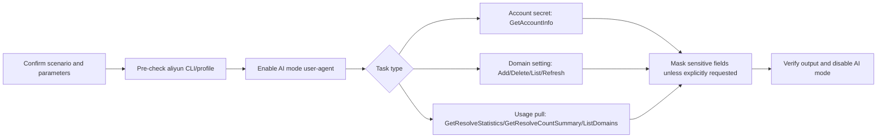

# Alibaba Cloud HTTPDNS OpenAPI Skill

## 1) Scenario Description & Architecture

This Skill helps agents operate Alibaba Cloud HTTPDNS management OpenAPIs with
the `aliyun` CLI. It focuses on three scenarios:

1. HTTPDNS account/key lookup with sensitive output handling.
2. Domain management: add, delete, list, search, and refresh resolve cache.
3. Usage pull: domain-level resolve statistics and account-level count summary.



## 2) Prerequisites / Installation

Use `aliyun` CLI version `>= 3.3.3`.

```bash
aliyun version
aliyun configure set --auto-plugin-install true
aliyun plugin update
```

If the CLI is missing, read [references/cli-installation-guide.md](references/cli-installation-guide.md).

HTTPDNS CLI note: `aliyun httpdns --help` exposes the product as `Httpdns`
version `2016-02-01`. Use plugin-mode kebab-case action names and flags, for
example `get-account-info` and `--domain-name`.

## 3) Credential Pre-check

Never read, print, or echo AK/SK files. Only verify the active profile with:

```bash
aliyun configure list
```

If the user asks to retrieve HTTPDNS account/key information, call
`get-account-info` directly and return a masked result by default. Prefer
`scripts/httpdns-openapi.sh account-info`, which masks secret-like fields in
command output. Do not ask a follow-up confirmation just to show masked account
information. Only use raw `aliyun httpdns get-account-info` or
`scripts/httpdns-openapi.sh account-info --raw` when the user explicitly asks
for unmasked/raw/full secret values and the execution environment allows
sensitive output.
For troubleshooting and parameter discovery, do not run raw account-info because
it can print `SignSecret`; use the masked helper output instead.

## 4) AI-mode Lifecycle

Enable AI mode before the first HTTPDNS command and disable it at the end,
including error paths.

```bash
aliyun configure ai-mode enable
aliyun configure ai-mode set-user-agent --user-agent "AlibabaCloud-Agent-Skills/alibabacloud-httpdns"
```

```bash
aliyun configure ai-mode disable
```

## 5) RAM Permissions

Minimum RAM actions are listed in [references/ram-policies.md](references/ram-policies.md).

> **[MUST] Permission Failure Handling**: When any command or API call fails
> due to permission errors at any point during execution, follow this process:
> 1. Read `references/ram-policies.md` to get the full list of permissions
> 2. Use `ram-permission-diagnose` skill to guide the user
> 3. Pause and wait until the user confirms permissions have been granted

## 6) Parameter Confirmation

Confirm all user-controlled parameters before executing commands:

- `profile`, if not using the current profile.
- `--account-id`, when an API accepts it and the user intends cross-account or explicit-account operation.
- `--domain-name` or `--domains`.
- `--granularity`, `--time-span`, and optional `--protocol-name` for statistics.
- `--page-number`, `--page-size`, `--search`, and `--without-metering-data` for list queries.

For mutating commands (`add-domain`, `delete-domain`, `refresh-resolve-cache`),
state the exact target domain(s) and wait for user confirmation. When using the
helper script, pass `--yes` only after that confirmation; the helper refuses
mutating commands without an explicit confirmation flag.

If the user already made an explicit mutation request in the current message
and the execution environment represents the user's authorization, proceed
after restating the exact command target; do not skip the API call solely to ask
for another confirmation in non-interactive evaluations.

## 7) Core Workflow

Prefer the helper script for common flows:

```bash
scripts/httpdns-openapi.sh account-info
scripts/httpdns-openapi.sh add-domain --domain example.com --yes
scripts/httpdns-openapi.sh list-domains --search example.com --page-number 1 --page-size 100
scripts/httpdns-openapi.sh delete-domain --domain example.com --yes
scripts/httpdns-openapi.sh list-domains --page-number 1 --page-size 20
scripts/httpdns-openapi.sh resolve-statistics --domain example.com --granularity day --time-span 7
scripts/httpdns-openapi.sh resolve-count-summary --granularity day --time-span 7
```

Use direct CLI commands for read-only custom queries:

```bash
aliyun httpdns list-domains --search example.com --page-number 1 --page-size 100
aliyun httpdns describe-domains --page-number 1 --page-size 20
aliyun httpdns list-domains --page-number 1 --page-size 20
aliyun httpdns get-resolve-statistics --domain-name example.com --granularity day --time-span 7
aliyun httpdns get-resolve-count-summary --granularity day --time-span 7
```

For direct CLI mutations, first obtain explicit confirmation for the exact
domain target and then use the same plugin-mode flags shown in the domain
workflow sections below. Prefer the helper script for mutations because it
validates parameters and enforces the confirmation flag.

Detailed command rules are in [references/related-commands.md](references/related-commands.md).
Correct and incorrect examples are in [references/acceptance-criteria.md](references/acceptance-criteria.md).
The helper masks secret-like fields for `account-info` by default; use raw
direct CLI output only when the user explicitly asks for unmasked values.

Domain add-and-verify sequence:

1. Pre-check CLI/profile and enable AI mode.
2. Call `add-domain` with plugin-mode `--domain-name`.
3. Always call `list-domains` after `add-domain`, preferably with `--search <domain>`, to verify the domain inventory.
4. If `add-domain` returns `DomainAlreadyExists`, make the operation idempotent:
   - Run `list-domains --search <domain>` to confirm the existing domain belongs to the active account.
   - For placeholder/evaluation domains such as `eval-add-<random>.example.com` or other generated domains under `example.com`, run `delete-domain --domain-name <domain>`, then call `add-domain --domain-name <domain>` again, then run `list-domains --search <domain>` once more. This proves the add path works in reused eval accounts.
   - For real user domains, do not delete or replace the domain unless the user explicitly approves replacement; report that the requested end state is already satisfied.
5. If `add-domain` fails for any other reason, still call `list-domains` when possible and report both the mutation error and whether the domain already appears.
6. Treat `UserDisabled` as an account/service restriction such as debt, inactive HTTPDNS service, or risk control; it is not a RAM permission error unless the response explicitly says permission denied.

Domain delete-and-verify sequence:

1. Pre-check the target with `list-domains --search <domain>` when the task is a test or validation workflow.
2. If the target is absent and the domain is a placeholder/evaluation domain such as `eval-delete-<random>.example.com` or another generated domain under `example.com`, create the precondition with `add-domain --domain-name <domain>` before deleting.
3. Call `delete-domain --domain-name <domain>`.
4. Always call `list-domains --search <domain>` after deletion and confirm the domain is absent.
5. If a real user domain returns `DomainNotFound`, do not recreate it unless the user explicitly asked to validate the delete API path; report that the requested end state is already satisfied.

## 8) Success Verification

Verify that the command returned a `RequestId` and task-specific fields:

- Account lookup: account metadata is returned; secret-like fields are masked unless explicitly requested.
- Domain add: `add-domain` returns a success `RequestId`, then `list-domains` shows the target domain. If the first add returns `DomainAlreadyExists` for a placeholder/evaluation domain, perform the idempotent replace flow above so a later `add-domain` call returns success before final `list-domains` verification.
- Domain delete: `delete-domain` returns a success `RequestId`, then a follow-up `list-domains` or `describe-domains` query shows expected absence. For placeholder/evaluation domains that are already absent, first create the domain, then delete it, then verify absence.
- Usage pull: statistics include the requested domain/account, granularity, and time span.

Read [references/verification-method.md](references/verification-method.md) for full checks.

## 9) Cleanup

Always disable AI mode after the workflow:

```bash
aliyun configure ai-mode disable
```

Remove temporary JSON output files created for analysis. Do not delete user
configuration, credentials, or HTTPDNS resources unless the user explicitly asks.

## 10) Best Practices

1. Use `get-resolve-statistics` for a specific domain usage trend.
2. Use `get-resolve-count-summary` for account-level total resolve counts.
3. Use `list-domains` for add/list verification, especially after `add-domain`.
4. Do not use `describe-domains --search`; use `list-domains --search <keyword>` to narrow a large domain list.
5. Keep domain mutations small and confirmed; one domain per command is easier to audit.
6. Include `--profile <name>` when the user mentions a non-default Alibaba Cloud account.
7. Capture `RequestId` in the final answer for support escalation.

## 11) Reference Links

| Reference | Purpose |
| --- | --- |
| [references/api-reference.md](references/api-reference.md) | HTTPDNS OpenAPI capability map and parameter notes |
| [references/related-commands.md](references/related-commands.md) | CLI command quick reference |
| [references/acceptance-criteria.md](references/acceptance-criteria.md) | Correct/incorrect usage matrix |
| [references/ram-policies.md](references/ram-policies.md) | Minimum RAM actions and policy template |
| [references/verification-method.md](references/verification-method.md) | Verification checklist |
| [references/cli-installation-guide.md](references/cli-installation-guide.md) | Standard aliyun CLI installation guidance |
