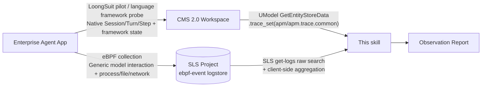

# Enterprise Agent Application Observability

## 1. Scenario Description

**Read-only observability analysis** of enterprise Agent applications integrated with Alibaba Cloud's observability stack: derive behavioral insights from Trajectory data and produce a self-contained HTML observation report. This skill **does not collect trajectories** — it only analyzes them.

**Six business questions** (per-scenario fact paths, required sections, and fixed gaps in `references/scenario-playbooks.md`):

| Scenario | Question | Typical Audience |
|---|---|---|
| PB-S1 Task Review | What was done, how many steps, any detours? | CS lead / Product / Ops |
| PB-S2 Failure Diagnosis | Which step failed, plain-English cause, what to investigate next? | Ops / CS / Dev |
| PB-S3 Latency Analysis | Which step is slow, how much slower than its own baseline? | Product / Ops |
| PB-S4 Consumption Analysis | Where did tokens go, any retry-driven amplification? (**token-only, no cost**) | Management / Finance |
| PB-S5 Multi-Agent Collaboration | Who handed off to whom, did failure land on main or sub-chain? | Product / Architect |
| PB-S6 Tool Quality | Which tool is least stable, failure rate and tail latency? | Ops |

Analysis method: **PB-1 two perspectives** — decision "cause" (why this call at this moment) and behavior "chain" (is this step on the critical path or an expensive detour), see `references/behavior-insight-playbook.md`.

**Architecture** (data plane read-only, no writes):



**Dual-source combination (not either-or)**: LoongSuit side carries call structure and decision context (evidence: `trace_id` + `span_id`, nodes carry `serviceName` for natural cross-Agent tracing); eBPF side carries runtime facts (evidence: `event.id` + `http.exchange.id`, process/container/host/network). Correlation key is **`trace_id`** — eBPF rows parse trace_id from `http.request.header.traceparent` and attach to LoongSuit side.

**Binding rules**: `--region` required; `--project` (eBPF/SLS) and `--workspace` (LoongSuit/CMS) **at least ONE** (values and clarification in §3). Binding only one side is a valid configuration: the run auto-narrows to that source, the absent side is explicitly marked as an **instrumentation gap** (`sources.<name>.bound=false` + `gap`), no silent degradation. Coverage gaps are reported as-is: eBPF side `gen_ai.*` indexed fields may all be empty (see `genai_index_coverage`) — this itself is a gap finding.

**Scope and discipline**: **Time dimension is on-demand ≤4h slices, analysis unit is a user-specified single trace (trace_id)** — the skill does not select traces, the target trace_id is always provided by the user; no full-day 24h aggregation or weekly/monthly long-span operational analysis; Scenario 7 (security audit) and Scenario 8 (weekly/monthly trends) are reserved extensions. Report output format is **self-contained HTML**: map trace facts to a single `TRACE_DATA` object injected into `references/report-template.html` template (`scripts/report_render.py`, contract in `references/report-render-spec.md`). **Division of labor**: scripts only do quantitative aggregation and evidence extraction; qualitative analysis is performed by the Agent executing this skill, no external model dependency.

> **⚠ Executive Summary (core constraints, at a glance)**:
> - **Analysis unit**: user-specified single trace (trace_id), skill does not select
> - **Final deliverables**: analysis summary + HTML report (both required, see §8 checklist)
> - **Max window**: ≤4h slice (span limit, not age limit)
> - **Read-only boundary**: CMS `get-entity-store-data`/`list-workspaces` + SLS `get-logs`/`list-log-stores`; SPL deny-list blocks 7 write-type operations
> - **Cost caliber**: token-only, no money; amounts write "missing", `delta_pct=null` marks "no baseline"

## ⚠ Mandatory Execution Rules

**All observability tasks must be executed via workflow.py**; direct calls to underlying scripts or cloud CLI are forbidden. workflow.py generates `<run-dir>/workflow-complete.json` (`status="success"`) on successful completion — **this file must exist with correct status before providing the final answer**. Providing conclusions without completing workflow = task failure.

For correct usage see §8 Core Workflow; forbidden practices: directly calling `preflight.py` / `span_search.py` / `trace_chain.py` / `decision_evidence.py` / `report_render.py`, or using `aliyun cms2` / `aliyun sls` commands directly.

## 2. Installation

**Pre-check: Aliyun CLI >= 3.3.3 required**

> [MUST] Verify: `aliyun version` — must be >= 3.3.3.
>
> - **First install or major upgrade:** `/bin/bash -c "$(curl -fsSL --connect-timeout 10 --max-time 120 https://aliyuncli.alicdn.com/setup.sh)"`
> - **Routine update (CLI >= 3.3.5):** `aliyun upgrade` — prefer this built-in self-update over re-running the install script.
> - See `references/cli-installation-guide.md` for full installation instructions.

**Pre-check: Aliyun CLI plugin update required**

> [MUST] run `aliyun configure set --auto-plugin-install true` to enable automatic plugin installation.
> [MUST] run `aliyun plugin update` to ensure that any existing plugins are always up-to-date.
> [MUST] Explicitly install both plugins: `aliyun plugin install --names aliyun-cli-sls aliyun-cli-cms` (SLS plugin provides `aliyun sls get-logs`/`list-log-stores`, CMS plugin provides multi-version API support for `aliyun cms get-entity-store-data`/`list-workspaces --api-version 2024-03-30`; neither is a built-in CLI product, missing plugin reports `'sls'/'cms' is not a valid built-in product`).

Python 3.8+ (standard library only, no third-party dependencies).

## 3. Data Source Binding & Parameters

Bindings can be provided via **CLI arguments or environment variables**, CLI takes precedence. `--region` required; `--project` and `--workspace` **at least ONE**. Missing required items cause immediate script termination listing all gaps.

**Environment variable fallback** (CLI takes precedence): `AGENT_OBS_REGION` → `--region`, `AGENT_OBS_SLS_PROJECT` → `--project`, `AGENT_OBS_CMS_WORKSPACE` → `--workspace`, `AGENT_OBS_SERVICE_NAME` → `--service-name`.

**Values come from the user**: ask the user for the **SLS Project name** (→ `--project` or `AGENT_OBS_SLS_PROJECT`) and **CMS 2.0 workspace name** (→ `--workspace` or `AGENT_OBS_CMS_WORKSPACE`). These names **must be obtained from the user** — the skill has no auto-discovery mechanism; if the user cannot provide them, state plainly that the analysis cannot proceed; do not guess or construct resource names. Full clarification script in `references/clarification-script.md`.

**Business facts to clarify with the user**: ① Agent application name (→ `--service-name`, LoongSuit side only), ② Region (→ `--region`), ③ Time range of the target trace (→ `--from/--to`, span ≤ 4h), ④ SLS Project name and CMS 2.0 workspace name (at least one), ⑤ **Target trace trace_id** (user-specified; if the user has no ready id, run `trace_overview.py` and offer `trace_candidates` for selection — present each candidate's `input_summary` (the user's original query excerpt) so the user can identify the target trace by its content, not by opaque hex ID — **skill does not select**).

**Full parameter list in §6 Parameter Confirmation** (binding, time slice, narrowing, truncation, report rendering, etc.). This section covers binding semantics and runtime env vars only.

Remaining env vars control **runtime behavior** (caching and concurrency), not data source binding:

| Environment Variable | Default | Description |
|---|---|---|
| `AGENT_OBS_MAX_WINDOW_HOURS` | `4` | **Max window limit = single query span (`to − from`) upper bound, not age limit**; any historical ≤4h slice is valid. **Agent clarification only, no script reads this var** — Step 0 self-checks, proceeds only if span ≤ this value |
| `AGENT_OBS_NO_CACHE` | — | `=1` disables local result cache (same as `--no-cache`) |
| `AGENT_OBS_CACHE_DIR` | System temp `agent_obs_cache/` | Result cache directory |
| `AGENT_OBS_CACHE_TTL` | `1800` | Expiry seconds for recent-window (ended <5min ago) cache entries; older windows are immutable and permanently cached |
| `AGENT_OBS_FETCH_WORKERS` | `4` | LoongSuit detail batch-fetch concurrency; set `1` for serial (byte-identical output) |
| `SKILL_SESSION_ID` | — | Source of `--user-agent` identifier (`obs_core.user_agent()` reads it; see §7, injected inline by Agent. **Not a session management feature**) |

> **Reading the table**: Except `AGENT_OBS_MAX_WINDOW_HOURS`, every env var is read directly by scripts. `AGENT_OBS_MAX_WINDOW_HOURS` is a **pure clarification convention**: no script reads or validates it, exceeding the span will **not** cause an error — it will just be very slow. Its only enforcement is the Step 0 clarification record.

## 4. Authentication

> **Pre-check: Alibaba Cloud Credentials Required**
>
> **Security Rules:**
>
> - **NEVER** read, echo, print, or dump AK/SK/STS token values in any form. The following commands are **explicitly FORBIDDEN** because they expose credential secrets to the terminal transcript:
>   - `echo $ALIBABA_CLOUD_ACCESS_KEY_ID` / `echo $ALIBABA_CLOUD_ACCESS_KEY_SECRET` / `echo $ALIBABA_CLOUD_SECURITY_TOKEN`
>   - `env | grep -i access` / `env | grep -i secret` / `env | grep -i token` / `printenv`
>   - `cat ~/.aliyun/config.json` / `cat ~/.alibabacloud/credentials` (these files contain plaintext `access_key_secret` and `sts_token`)
>   - Any other command whose output includes credential **values** (not just type or status)
> - **NEVER** ask the user to input AK/SK directly in the conversation or command line
> - **NEVER** use `aliyun configure set` with literal credential values
> - **ONLY** use `aliyun configure list` to check credential status (it masks values, showing only the type prefix)
>
> ```bash
> aliyun configure list
> ```
>
> Check the output for a valid profile (AK, STS, or OAuth identity).
>
> **If no valid profile exists, STOP here.**
>
> 1. Obtain credentials from [Alibaba Cloud Console](https://ram.console.aliyun.com/manage/ak)
> 2. Configure credentials **outside of this session** (via `aliyun configure` in terminal or environment variables in shell profile)
> 3. Return and re-run after `aliyun configure list` shows a valid profile

**STS credential basics** (auto-detected by `scripts/preflight.py` `credentials` check; only outputs credential **type**, never credential values):

- `AK`: Long-lived AccessKey. Permissions must be granted to the RAM user/root account itself.
- `STS`: Temporary credential, **expires** (expiry manifests as `InvalidSecurityToken.Expired`); must be reconfigured outside the session, never request or paste within a session.
- `RamRoleArn` / `ChainableRamRoleArn`: Cross-account AssumeRole. **Permissions in `references/ram-policies.md` must be granted to the assumed role, not the caller**; the role's trust policy must also allow the current caller to assume it.
- `EcsRamRole` / `CredentialsURI`: Auto-obtained by instance or external credential source, no manual configuration needed.
- Unrecognized type prefixes are **reported as-is** (marked `credential_recognised=false`), never guessed or fabricated.

Required RAM permissions: CMS 2.0 read-only (`cms:ListWorkspaces` / `cms:GetEntityStoreData`) + SLS read-only, see `references/ram-policies.md`.

## 5. RAM Policy

See `references/ram-policies.md` (LoongSuit source `cms:ListWorkspaces` / `cms:GetEntityStoreData`; eBPF source `log:GetLogStoreLogs` / `log:GetIndex` / `log:ListLogStores` / `log:GetProject`, scoped to bound project). This skill **does not use** `cms_natural_language_query` (which requires `CreateThread` / `CreateChat` write permissions), so those are not requested.

> **[MUST] Permission Failure Handling:** When any command or API call fails due to permission errors at any point during execution, follow this process:
>
> 1. Read `references/ram-policies.md` to get the full list of permissions required by this SKILL
> 2. Use `ram-permission-diagnose` skill to guide the user through requesting the necessary permissions
> 3. Pause and wait until the user confirms that the required permissions have been granted

## 6. Parameter Confirmation

> **IMPORTANT: Parameter Confirmation** — Before executing any command or API call,
> ALL user-customizable parameters (e.g., RegionId, instance names, CIDR blocks,
> passwords, domain names, resource specifications, etc.) MUST be confirmed with the
> user. Do NOT assume or use default values without explicit user approval.

| Parameter | Required | Description | Default |
|---|---|---|---|
| `--region` | ✅ Required | Region shared by both data sources | None; check memory first, ask user if unavailable |
| `--project` | At least ONE | eBPF source: SLS project holding `ebpf-event` | None; **ask user only**, no auto-discovery |
| `--workspace` | At least ONE | LoongSuit source: CMS 2.0 workspace name, real query parameter for `GetEntityStoreData` | None; same as above |
| `--mode` | Optional | `both` (dual-source) / `loongsuit` / `ebpf` | `both` (auto-narrows when only one side bound). Deprecated values `trace`/`event`/`auto` error with rename mapping |
| `--logstore` | Optional | eBPF logstore override | `ebpf-event` |
| `--service-name` | Optional (recommended) | LoongSuit-side narrowing only; ebpf-event index has no `service.name`, that side always marks `service_filter_unavailable` | No filter |
| `--agent-type` / `--comm` / `--container-id` / `--host` / `--event-name` / `--trace-id` | Optional | eBPF-side narrowing: `container-id`/`host`/`event-name` are indexed for **server-side** filtering; `agent-type`/`comm`/`trace-id` are unindexed, **client-side** filtering only | No filter |
| `AGENT_OBS_MAX_WINDOW_HOURS` | Optional | **Agent self-check, no script reads**: window **span** upper bound | `4` |
| `--hours` / `--from` / `--to` | Optional | Observation time slice; constraint is **span** not age. Preferred form: `--from/--to` | 4h span |
| `--agent` | Optional | Filter by `gen_ai.agent.name` (LoongSuit side); enumerate first, let user pick | No filter |
| `--trace-id` / `--span-id` / `--event-id` | Per-script required | Analysis anchor: `trace_chain.py` always `--trace-id` (both sources same anchor); `decision_evidence.py` uses `--span-id` (LoongSuit) or `--event-id` (eBPF) to target, `--trace-id` reaches traces without ENTRY | — |
| `--match` (`span_search.py` only) | ✅ Required | Content search: scans LoongSuit span messages input/output **all roles**, produces `{trace_id, span_id, field}` location + snippet; ebpf-event has no message payload, script is LoongSuit-only | — |
| `--limit` (`span_search.py` only) | Optional | Content search hit count cap | 50 |
| `--margin` | Optional | Seconds added outside trace boundary for LoongSuit auto-narrowing (eBPF side cannot narrow) | 300 |
| `--max-traces` | Optional | Per-window trace enumeration cap for LoongSuit side (enumeration scripts `trace_overview` / `span_search` / `decision_evidence` fallback); outputs `enumeration_truncated` when hit | 200 |
| `--event-limit` | Optional | eBPF-side chain output exchange count cap | 200 |
| `--no-cache` | Optional | Bypass local result cache | Cached by default |
| `--detail-limit` / `--list-limit` | Optional | Text truncation length / list cap | 2000 (chain 200) / 200 |
| `--facts` / `--spec` / `--out` (`report_render.py` only) | Required / Optional / Required | Saved `trace_chain.py` JSON output (`chain=PATH`, required); Agent annotation JSON (`{schema_version, title?, notes{spanId}}`, **text only, no numbers**); HTML output path (`-` for stdout). **This script makes zero cloud calls, does not accept binding parameters** | — |
| `--template` / `--text-limit` (`report_render.py` only) | Optional | Page template path / single spec text field length cap | `references/report-template.html` / 4000 |

## 7. Observability (MUST follow for every aliyun command)

Upon loading this skill, generate a random session ID (32-char lowercase hex string) once for the entire session. Use it as `{session-id}` below.

**Rule: Every `aliyun` CLI command that calls a cloud API MUST include the `--user-agent` flag.**
Local utility commands (e.g. `configure`, `plugin`, `version`) do not support this flag and should be excluded.

```
--user-agent AlibabaCloud-Agent-Skills/alibabacloud-agent-observability/skill-version/{version}/{session-id}
```

The `{version}` is read from `references/manifest.json` (top-level `"version"` field) by `obs_core.skill_version()`.

Example (assuming version `1.0.0` and session-id `a1b2c3d4e5f6a7b8c9d0e1f2a3b4c5d6`):

```bash
aliyun ecs describe-instances --biz-region-id cn-hangzhou --user-agent AlibabaCloud-Agent-Skills/alibabacloud-agent-observability/skill-version/1.0.0/a1b2c3d4e5f6a7b8c9d0e1f2a3b4c5d6
```

Do not skip, alter the format of, or omit `--user-agent` on any `aliyun` API command invocation.

**This skill does not require manual UA injection**: every cloud call from all scripts (`cms_trace.py` / `sls_event.py` / `preflight.py`) is automatically assembled by `obs_core.user_agent()` with the above `--user-agent`; `aliyun version` / `plugin list` / `configure list` are local commands that do not support this flag and are excluded.

`SKILL_SESSION_ID` is the **UA identifier source** read by scripts (`obs_core.session_id()` → `obs_core.user_agent()`), not a session management feature — inject inline when running scripts:

```bash
SKILL_SESSION_ID={session-id} python3 scripts/trace_chain.py --trace-id <32hex> ...
```

When unset, the UA trailing segment is empty — functionality is unaffected but per-session call attribution is lost; always inject. Prohibit `export ALIBABA_CLOUD_USER_AGENT` (does not survive across bash invocations); prohibit `aliyun configure ai-mode` (deprecated). This skill has **no Python SDK / Terraform calls** (pure aliyun CLI + Python standard library scripts).

## 8. Core Workflow

**Entry point: `scripts/workflow.py`** — the deterministic orchestrator for every
complete user-facing analysis. It runs `preflight → (span_search → select) →
trace_chain → decision_evidence → report_render` in one invocation, persists
every intermediate JSON under `<run-dir>/facts/`, writes the HTML report under
`<run-dir>/reports/html/`, and emits a manifest at `<run-dir>/workflow.json`
recording each step's exit status, output hash, and the selected
trace_id/span_id. **Use workflow.py; do not re-invent the sequence by calling
the child scripts by hand.** The child scripts remain available as diagnostic
building blocks (`references/related-commands.md`), but a complete analysis is
one workflow.py command.

Two subcommands cover the two user intents:

```
User request contains search intent?
├─ YES ("搜索包含X的span" / "find spans with keyword Y" / content location)
│  └─ workflow.py search --match TEXT --select {first|unique}
│        · --select first : take hits[0] (only when user explicitly asked for the first)
│        · --select unique: continue only when all hits share one trace_id,
│                           otherwise stop and ask the user to pick
│
└─ NO ("分析trace_id=xxx" / analyze a known trace)
   └─ workflow.py trace --trace-id <32hex>
```

```bash
# search intent — one command runs the full pipeline
SKILL_SESSION_ID={session-id} python3 scripts/workflow.py search \
  --region <region> --workspace <CMS workspace> [--project <SLS project>] \
  [--service-name <app>] --from <ts> --to <ts> \
  --match "keyword" --limit 50 --select {first|unique}

# known trace — one command runs the full pipeline
SKILL_SESSION_ID={session-id} python3 scripts/workflow.py trace \
  --region <region> --workspace <CMS workspace> [--project <SLS project>] \
  --trace-id <32hex> --from <ts> --to <ts>
```

The workflow: ① runs `preflight.py --strict` first and stops on any failure;
② captures each child's JSON stdout and writes it under `<run-dir>/facts/`;
③ in search mode, derives `trace_id` / `span_id` only from the current
search result per the `--select` policy; ④ runs `trace_chain.py` and
`decision_evidence.py` against that trace; ⑤ runs `report_render.py` to
produce the HTML artifact; ⑥ writes `<run-dir>/workflow.json` with ordered
steps, SHA-256 of every output, and the report path/hash. Fail-fast on
non-zero child exit, invalid JSON, empty search hits, invalid selection, or
missing report. The manifest never contains credentials or raw command
output (structurally redacted before write).

> **Deliverable Checklist (both required)**:
> 1. **Analysis Summary**: 3–8 paragraphs answering the user's question, with
>    evidence identifiers (trace_id/span_id/event.id), not restating script output.
> 2. **HTML Report Path**: the `report.path` value from `workflow.json`, user can
>    open offline.
>
> If `workflow.py` exited non-zero, read `<run-dir>/workflow.json`
> `failed_stage` / `error` and report them; do not paper over the failure
> with a text-only answer.

**Exit discipline when trace does not exist (TTL limit)**:

For the same `(trace_id, slice)` combination, the skill makes at most **3** different query attempts:
1. `trace_overview` checks whether the target trace_id exists in the window (check `totals.trace_ids` list)
2. `trace_chain --trace-id` reconstructs the trace (both sources same anchor)
3. `decision_evidence --trace-id` direct reach (no enumeration, reaches traces without ENTRY)

3 misses → **exit immediately**, must NOT:
- Auto-shift/expand the slice (span was user-confirmed, changing span = changing the question)
- Switch `--mode` (loongsuit↔ebpf↔both) and retry
- Use `span_search --match` with different keywords/roles and retry
- Return to Step 0 to re-clarify or start a new query round

On exit, must output an **anomaly notice** (fixed structure, all parts required):
1. **Conclusion**: `trace_id {id} not found in slice {from}~{to} (span {X}h)`
2. **Attempted paths**: list the 3 attempts with results (e.g., `trace_overview` returned N traces but target not in `trace_ids` list; `trace_chain` reported `no spans found`; `decision_evidence` reported `span not found`)
3. **Candidate next steps** (up to 3, **user chooses, Agent must not auto-execute**):
   - Verify trace_id is 32-char hex, copied from console/log verbatim (wrong value causes silent 0-row results)
   - Shift slice to the trace's actual time range (same span, user provides new `--from/--to`)
   - Use `trace_overview` output `trace_candidates` list to select a target trace (present each candidate's `input_summary` to help the user identify the right trace)
4. **Must not guess** why the trace does not exist (could be collection lag, binding error, trace_id typo, app not reporting — telemetry cannot determine this)

**Step 0 — Confirm Analysis Scope (must do before execution)**:

1. **Clarify business facts**: ① Agent application name, ② Region, ③ Target trace time range, ④ **SLS Project name and CMS 2.0 workspace name (at least one)**, ⑤ **Target trace trace_id** — analysis unit is a user-specified single trace, skill does not select traces; if the user has no ready id, explain that Step 1 `trace_candidates` (with `input_summary` showing each trace's original query) can be used for selection, **do not select for them**. Check memory/session context first, ask per `references/clarification-script.md` script if unavailable. Time range must be narrowed to specific hours — "last week" / "a few days ago" are not acceptable.
2. **Convert time range to concrete slice**: self-check `echo ${AGENT_OBS_MAX_WINDOW_HOURS:-4}`, convert to unix seconds and pass as `--from/--to` (conversion **must include `:%S`**). When span > limit, **do not execute any queries**, re-clarify or split into multiple ≤ limit slices.
3. **Clarification record (sole execution prerequisite)**: before any query, must leave an explicit conclusion line in the conversation —
   > App name = {service-name}; Region = {region}; Binding project={project} / workspace={workspace}
   > (user-provided); Max window limit = {N}h; Confirmed slice with user =
   > {YYYY-MM-DD HH:MM}~{HH:MM}(`--from {ts} --to {ts}`), span {X}h ≤ {N}h; Target trace trace_id =
   > {trace-id}; proceeding to Step {n}.

**Step 0.5 — Config Preflight** (handled by `workflow.py` internally; run
manually only when diagnosing): `preflight.py --strict <binding>` runs seven
config checks (`cli_version` / `plugins` / `credentials` / `bindings` /
`sls_project` / `ebpf_logstore` / `cms_workspace`), outputs credential
**type** only, never values. Unbound side checks are `skipped` — a valid
configuration, not a failure. Details in `references/preflight-checks.md`.

> **Performance tip (span convergence first)**: wide time range requirements should be **split into multiple ≤4h slices queried individually**, do not expand single-query span. eBPF side **cannot** auto-narrow windows (anchor fields are unindexed, `window_narrowed` is always null), so slice narrowing is even more important for cost control. Entry points and narrowing/paging details in §12 Best Practices 2 and 4.

> **Placeholder convention**: `<binding>` below always means `--region <region>` plus `--project <SLS Project>` and `--workspace <CMS workspace>` (at least one, both recommended) + optional `--service-name <app name>`. `<confirmed slice>` always means `--from <ts> --to <ts>`.

**Step 1 (optional) — Panoramic Health / Drift & Trace Verification** (for global questions; or when user has no target trace_id, use output `trace_candidates` for selection — present each candidate's `input_summary` so the user can identify traces by content. LoongSuit: error rate, model/tool composition, react rounds, loop candidates, cross-Agent services, `steps_from_span_kind`, in-window trace list `trace_ids` + `trace_candidates`; eBPF: process/container/host/network/HTTP composition, exchange latency, `genai_index_coverage`. For suspected drift add `--compare-hours <N>`, **comparison is LoongSuit side only**, baseline window must also be ≤ limit):

```bash
SKILL_SESSION_ID={session-id} python3 scripts/trace_overview.py <binding> <confirmed slice> [--agent NAME] [--compare-hours 4]
```

**Step 1b — Content Search Location** (when the user's intent is search,
**use `workflow.py search`** from §8 top; the standalone
`span_search.py <binding> <slice> --match "keyword" [--limit 50]` form
remains for diagnostics). LoongSuit side only — ebpf-event carries no
message payload. Output `hits[]` carries `{trace_id, span_id, field,
snippet}`; feed the chosen hit's `trace_id` / `span_id` into the workflow
via `--select first` (user asked for the first) or `--select unique` (all
hits resolve to one trace).

**Steps 2 / 3 / 5 — Trace reconstruction, evidence extraction, report
rendering** are all performed inside `workflow.py` (see §8 top). The
standalone scripts below remain for diagnostic / partial runs; for a
complete analysis prefer the single workflow command.

**Step 2 — Trace Reconstruction** (`trace_chain.py`, all modes require `--trace-id`. LoongSuit: parent-child tree + loop/failure annotation + `latency` decomposition + `context_growth`, auto-narrows window to trace boundary ± `--margin`; eBPF: `http.exchange.id` paired request/response exchange timeline + `patterns` (failed exchanges, 5xx, repeated calls, unpaired) + process/container/host facts. `both` mode: both sources same anchor, single-side absence marked `present=false` as instrumentation gap):

```bash
SKILL_SESSION_ID={session-id} python3 scripts/trace_chain.py <binding> --trace-id <32hex> <confirmed slice>
SKILL_SESSION_ID={session-id} python3 scripts/trace_chain.py <binding> --mode ebpf --trace-id <32hex> <confirmed slice>
```

**Step 3 — Evidence Extraction** (LoongSuit: target span messages/arguments, ancestor chain, sibling steps, react rounds; `--trace-id` can **directly reach traces without ENTRY** (no enumeration fallback). `--mode both` also includes `runtime_calls` — **span-level correlation** via traceparent third segment `parent_span_id` ↔ LoongSuit `spanId`, precisely answering "which external calls did this span initiate", with **measured** `match.span_match_rate` (low rate means probe did not carry this span's id, not that the call did not exist); eBPF: target runtime facts + three-ring context — same `http.exchange.id`, same `pid` ±60s, same `trace_id`. eBPF side `messages`/`entry_task` are always null because ebpf-event has no message payload. Neither side has `gen_ai.request.id`, so application-layer request id correlation is not possible):

```bash
SKILL_SESSION_ID={session-id} python3 scripts/decision_evidence.py <binding> --span-id <span-id> <confirmed slice>
SKILL_SESSION_ID={session-id} python3 scripts/decision_evidence.py <binding> --trace-id <32hex> <confirmed slice>
SKILL_SESSION_ID={session-id} python3 scripts/decision_evidence.py <binding> --mode ebpf --event-id <event.id> <confirmed slice>
```

**Step 4 — Analysis**: execute per `references/behavior-insight-playbook.md` (two perspectives). Field semantics: LoongSuit side per `references/otel-genai-attributes.md`, eBPF side per `references/ebpf-event-fields.md`.

**Step 5 — Produce Report (HTML)**: inside `workflow.py` this is the final
step and uses the chain JSON persisted under `<run-dir>/facts/`. When
running the renderer directly, save `trace_chain.py` JSON to disk and pass
it via `--facts chain=<path>`; optional annotation spec per
`references/report-render-spec.md`:

```bash
python3 scripts/report_render.py --facts chain=reports/facts/chain.json \
  [--spec reports/facts/notes.json] --out reports/html/<scenario>.html
```

The renderer maps trace facts to a single `TRACE_DATA` object (`{meta, summary, spans}`) injected into the bundled template `references/report-template.html`; the template includes all rendering logic, missing data shows "No data available" rather than fabrication. Three disciplines: ① Full **structural redaction + script-safe encoding** for telemetry body (`TRACE_DATA` injected as `<`/`>`/`&` fully-escaped JSON literal, strings cannot escape the template script block), self-containment enforced by renderer **measurement** (external asset references must be 0, `<script>` blocks must be exactly 1, template pollution causes render refusal); ② All amounts marked `missing` (neither source has price/billing fields, can declare unobtainable but must not give a numeric value); ③ Period-over-period conclusions can only say "vs. previous slice", no baseline writes "no baseline" not `0%` (applies to `--compare-hours` drift comparison and any period-over-period expression). Every qualitative conclusion must cite an evidence identifier (LoongSuit: `trace_id`/`span_id`; eBPF: `event.id`/`http.exchange.id`).

**Step 6 — Final Output (two fixed parts)**: the skill's final deliverable must include both parts below, neither can be omitted:

1. **Analysis summary answering the user's question**: natural language directly answering the user's original question (e.g., "why is this trace slow", "which step failed", "token consumption distribution"), with **conclusive judgment + key evidence identifiers** (trace_id/span_id/event.id), 3–8 paragraphs. Do not restate script output verbatim — distill insights.
2. **Agent Trace Observation Report (HTML)**: when driven by `workflow.py`,
   the `report.path` value from `<run-dir>/workflow.json`; when driven
   manually, the Step 5 rendered HTML file path (e.g.,
   `reports/html/<scenario>.html`). The report is the **fact layer**, the
   summary is the **analysis layer**, they complement each other.

Output order: summary first, then report path. Evidence cited in the summary must be locatable in the report (same trace_id/span_id).

### Implementation Carriers (CLI/Code vs Agent vs Human-Machine Interaction)

Data access and quantitative aggregation are **all** implemented via aliyun CLI + Python standard library scripts (command and API list in `references/related-commands.md`, `related_apis.yaml`). The following functions **cannot be implemented via CLI or code**:

| Function | Stage | Why CLI/Code Cannot Implement | Implementation Carrier & Fallback |
|---|---|---|---|
| Qualitative analysis (PB-1 two perspectives) | Step 4 | Requires semantic understanding and causal reasoning on messages/inference text | Agent analyzes per `behavior-insight-playbook.md`; every conclusion must carry evidence identifiers |
| Report composition | Step 5 | Natural language conclusion generation | Agent writes annotation spec per `report-render-spec.md`, passes to `report_render.py` to map to `TRACE_DATA` for template rendering |
| Final output organization (summary + report) | Step 6 | Requires semantic distillation of user question and structured presentation | Agent writes 3–8 paragraph analysis summary (conclusion + evidence identifiers), followed by HTML report path; summary does not restate script output, distills insights |
| Plain-language attribution & suggested actions | Step 4/5 | Requires semantic classification of error signatures | Agent analyzes per `attribution-taxonomy.md`; **renderer has no mapping table**, code only renders Agent-provided labels |
| Scope clarification & target confirmation | Step 0 | Requires user decisions; `AGENT_OBS_MAX_WINDOW_HOURS` is not read by scripts | Agent leads interaction and leaves Step 0 clarification record (including target trace_id) |
| Binding retrieval via "memory search" | §3, Step 0 | Depends on host Agent's memory capability | When memory unavailable, **ask user**; if user cannot provide, state plainly that analysis cannot proceed, **do not guess or construct resource names** (skill has no auto-discovery) |
| Permission failure guidance (`ram-permission-diagnose`) | §5 | Depends on **external skill** | When not installed, fallback to manual reference to `references/ram-policies.md` |
| Session-id generation & injection | §7 | Convention: Agent generates 32-char lowercase hex | Scripts read from `SKILL_SESSION_ID` |

**Data-plane gap ≠ CLI/code capability gap**: ebpf-event `gen_ai.*` indexed fields are all empty in practice, `gen_ai.step.id` is never populated on LoongSuit side either (step layer can only be derived from `gen_ai.span.kind=STEP` + lineage, marked `step_id_source`), ebpf-event has no message payload — these are all data-side facts, always marked "missing/unknown", never fabricated.

## 9. Success Verification

Step-by-step verification commands in `references/verification-method.md`. Minimum criteria:

1. **Workflow manifest** (`<run-dir>/workflow.json`): `status == "ok"`, every
   step's `exit_code == 0`, `selection.trace_id` / `selection.span_id`
   populated (search mode), `report.path` exists and `report.sha256` matches
   the on-disk HTML. When `workflow.py` is the entry point this single
   check replaces the per-script checks below.
2. `preflight.py` seven checks (when run standalone): fully bound → overall status `ok`; one-side binding → corresponding checks are `skipped` not `fail`; credentials item only outputs `credential_type`, no credential values in `stdout`; `--strict` with any `fail` → exit code 2
3. `trace_overview.py` LoongSuit side returns non-empty aggregation (`totals.genai_spans > 0`) with `steps_from_span_kind` and in-window `trace_ids`; eBPF side includes `by_event`/`by_process`/`latency`/`genai_index_coverage`
4. `span_search.py` LoongSuit side `--match` returns `hits[]` with each containing `trace_id`/`span_id`/`field`; eBPF-only binding errors (ebpf-event has no message payload)
5. `trace_chain.py` for specified `--trace-id` returns single `trace_id`-anchored ordered chain (LoongSuit side includes `latency`/`context_growth`); eBPF side returns exchange timeline with `latency_pairs > 0`
6. `decision_evidence.py` LoongSuit side returns `ancestor_chain`; `--trace-id` reaches traces without ENTRY; eBPF side returns three-ring context with `messages`/`entry_task` as null
7. Every qualitative conclusion in the observation report traces back to evidence identifiers (`trace_id`/`span_id` or `event.id`/`http.exchange.id`)
8. `report_render.py` (when run standalone): output is template-injection form (contains `window.TRACE_DATA = {…}` and `<title>` is report title); render summary `self_contained.{external_assets,script_blocks,inline_js}` is `0/1/1` (template provides the sole script block), `redaction.hits` accurately records redaction hits
9. **Final output has two fixed parts**: ① Analysis summary answering user's question (3–8 paragraphs, conclusion + evidence identifiers, not restating script output); ② HTML report file path. Both required, evidence cited in summary must be locatable in report

## 10. Cleanup

This skill is read-only throughout: creates no cloud resources, no cleanup needed. Local traces are stdout/report files only, delete as needed.

## 11. Command Table

Full CLI/script commands in `references/related-commands.md`.

## 12. Best Practices

1. **Read-only baseline**: LoongSuit side only uses `get-entity-store-data` / `list-workspaces` within `cms_trace.CMS_ACTION_WHITELIST`; eBPF side only uses `get-logs` / `list-log-stores` (built-in write verb interception). **CMS SPL has a separate deny list**: SPL `http-call` / `llm-call` / `agentic-call` / `embedding` / `entity-call` / `prom-call` / `graph-call` initiate external or model calls, `cms_trace.SPL_DENY` refuses all, do not bypass.
2. **Preflight before drill-down**: Step 0.5 run `preflight.py` to confirm environment; then clarify the **specific time period** of the target trace and pin a `--from/--to` slice (span ≤ limit) → with user-specified trace_id go directly to `trace_chain.py --trace-id` (if user has no ready id, use `trace_overview.py` `trace_candidates` with `input_summary` for selection, or `span_search.py --match` for content location). **Include `--service-name` from the first command** (LoongSuit side only); eBPF side use `--agent-type`/`--comm`/`--container-id` to narrow.
3. **Evidence first**: qualitative conclusions must carry evidence identifiers (LoongSuit: `trace_id`/`span_id`; eBPF: `event.id`/`http.exchange.id`); insufficient evidence writes "missing", never fabricate.
4. **Window narrowing & paging**: LoongSuit side auto-narrows to trace boundary ± `--margin` (default 300s); eBPF side **cannot** narrow (anchor fields unindexed), single raw search per logstore capped at 2000 rows, exceeding outputs `fetch_truncated: true` — all counts are then samples not full volume, must declare.
5. **Cache reuse**: all query results go through local cache (window ended >5min ago is immutable permanent cache). Using `--from/--to` to pin confirmed historical slices satisfies both span limit and lands in permanent cache; `--hours` is recent window, repeated runs basically never hit cache. Iterative analysis should not add `--no-cache`.
6. **Self-baseline comparison**: LoongSuit chain output `latency.baseline` is in-trace self-baseline (TTFT median/p95, decode throughput, context size quantiles); window-level drift comparison uses `trace_overview.py --compare-hours`, period-over-period can only say "vs. previous slice".
7. **Caliber transparency**: LoongSuit side `gen_ai.step.id` is never populated, step layer derived from `gen_ai.span.kind=STEP` + parent-child and marked `step_id_source`; error determination uses three-tier caliber (`statusCode=2` → `finish_reasons` → attributes). eBPF side `genai_index_coverage` all-zero means collector only outputs runtime facts, not GenAI attributes — GenAI attribute insights must go through LoongSuit side. `service_filter_unavailable: true` means ebpf-event index has no `service.name`, application filtering is impossible on that side.
8. **Truncation discipline**: messages default list 200 / detail 2000 characters; need longer context use `--detail-limit` to re-extract, do not guess full text.
9. **Dual-source combination**: default `both` — decision context prioritizes LoongSuit side, runtime behavior (process/network/HTTP) looks at eBPF side, both correlated by `trace_id` (`trace_chain.py` both sources same anchor). When only one side is bound, output explicitly marks absent source as instrumentation gap, **must not** assert trace non-existence from single-source absence.
10. **Analyze based on script output**: variable/generalizable parts of analysis are performed by Agent directly based on script standard output (`--format json` is default and stable machine contract; `--format yaml` is isomorphic), no ad-hoc shell/python scripts for secondary processing.
11. **HTML report discipline**: reports are distributable artifacts, not temporary session output, so redaction/script-safe encoding/self-containment and cost caliber all follow Step 5's three disciplines — renderer performs **measured** self-containment scan (external asset references = 0, `<script>` blocks = 1, template pollution refuses rendering); plain-language attribution classified by Agent per `references/attribution-taxonomy.md`, **no mapping in code**.
12. **Exit immediately when trace not found (TTL limit)**: at most 3 query attempts for same `(trace_id, slice)` combination (see §8 Core Workflow opening "exit discipline when trace does not exist"); 3 misses outputs anomaly notice and stops, **must not** auto-change slice/mode/keywords to retry or return to Step 0 to re-clarify. Candidate next steps chosen by user, Agent must not auto-execute.

**Common Pitfalls**:

| Pitfall | Correct Approach | Rule Source |
|---|---|---|
| Output summary only, skip report rendering | Report is required deliverable, both parts needed | §8 Deliverable Checklist |
| Auto-change slice/mode when trace not found | Exit immediately, output anomaly notice, user chooses next step | §8 TTL discipline / item 12 |
| Assert trace non-existence from single-source absence | Single-source absence marks `present=false` as gap, not non-existence | Item 9 |
| Give numeric amount or `delta_pct=0%` | Amount writes "missing", no baseline writes "no baseline" | Step 5 discipline |
| Answer user after analysis, skip report | Checkpoint reminder: analysis ≠ delivery, must continue Step 5/6 | Step 4 Checkpoint |

## 13. Reference Links

| Document | Content |
|---|---|
| [references/otel-genai-attributes.md](references/otel-genai-attributes.md) | LoongSuit field dictionary (CMS 2.0 UModel, measured) |
| [references/ebpf-event-fields.md](references/ebpf-event-fields.md) | eBPF field dictionary (SLS ebpf-event, measured index and rows) |
| [references/cms-umodel-query.md](references/cms-umodel-query.md) | CMS 2.0 SPL umodel query cheatsheet (directives, pipe commands, deny list) |
| [references/preflight-checks.md](references/preflight-checks.md) | Preflight seven checks details and fix hints |
| [references/clarification-script.md](references/clarification-script.md) | Pre-clarification script (including time range guidance) |
| [references/behavior-insight-playbook.md](references/behavior-insight-playbook.md) | PB-1 two perspectives behavioral insight analysis method |
| [references/scenario-playbooks.md](references/scenario-playbooks.md) | 6 business scenario playbooks (PB-S1…PB-S6: audience, fact path, required sections, fixed gaps) |
| [references/report-render-spec.md](references/report-render-spec.md) | HTML report rendering contract (TRACE_DATA template injection, self-check rules, redaction and self-containment guards) |
| [references/attribution-taxonomy.md](references/attribution-taxonomy.md) | Plain-language attribution table and suggested action mapping (Agent analysis, not in code) |
| [references/ram-policies.md](references/ram-policies.md) | CMS/SLS read-only permission list |
| [references/related-commands.md](references/related-commands.md) | CLI/script command table |
| [references/verification-method.md](references/verification-method.md) | Step-by-step success verification |
| [references/acceptance-criteria.md](references/acceptance-criteria.md) | Acceptance criteria (✅/❌ patterns) |
| [references/cli-installation-guide.md](references/cli-installation-guide.md) | Aliyun CLI installation guide |
| [references/manifest.json](references/manifest.json) | Skill version manifest (`{"version": "x.y.z"}`) |
