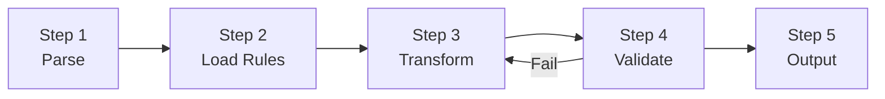

> This skill has been validated on the Qoder / QoderWork platform. It is a pure content-generation skill that does not invoke external tools. It can also be used on other Agent platforms, though trigger matching behavior may vary.

# Cross-Engine SQL Syntax Translation (migration-sdm-sql-trans)

## Security Red Lines

- Never embed real customer database/table/column names in conversion examples or output (replace with `tbl_demo`, `col_x`)
- Never embed real business data (phone numbers, IDs, account numbers, etc.) in example SQL; use placeholders where needed
- Conversion output is generated content — **for reference only; human review before executing in production is recommended**
- Never store any AK/SK, passwords, or plaintext connection strings in SKILL.md or references files

## MCP Tool Inventory

> This skill is pure content generation and does not depend on external MCP tools or CLI. All conversions are driven by built-in rule documents and mapping tables.

## 1. Overview

Provides SQL syntax conversion capabilities across big-data engines (DML / DDL / stored procedures / functions, etc.). This skill uses a **"multi-directional language-pair + extensible conversion-rules" architecture**, following a unified 5-step main process to complete each conversion, with implementations for additional engine pairs added incrementally.

## 2. When to Use / When NOT to Use

| When to Use | When NOT to Use |
|-------------|-----------------|
| Cross-data-warehouse SQL rewriting (T-SQL → PG, Hive → MaxCompute, etc.) | Table structure (DDL) migration only → `migration-sdm-ddl-trans` |
| Full conversion of DML / views / stored procedures | ADF workflow migration → `migration-sdm-adf2dw` |
| Compatibility checks and rewriting suggestions | Data integration job generation → `migration-sdm-dw-di-generator` |

## 3. Support Matrix

| Source → Target | Status | Implementation Location |
|-----------------|--------|------------------------|
| **Synapse (T-SQL) → Hologres (PostgreSQL)** | ✅ Implemented | "Scenario Implementation" section below + [reference.md](references/reference.md) + [examples.md](references/examples.md) |
| SQL Server (T-SQL) → MaxCompute (ODPS-SQL) | 🟡 TODO | Pending `references/sqlserver_to_maxcompute.md` |
| Hive QL → Hologres | 🟡 TODO | Pending `references/hive_to_hologres.md` |
| Hive QL → MaxCompute | 🟡 TODO | Pending `references/hive_to_maxcompute.md` |
| PostgreSQL → Hologres | 🟡 TODO | Pending `references/postgresql_to_hologres.md` |
| Oracle (PL/SQL) → MaxCompute | 🟡 TODO | Pending `references/oracle_to_maxcompute.md` |
| Teradata → MaxCompute / Hologres | 🟡 TODO | Pending `references/teradata_to_*.md` |
| Snowflake → MaxCompute / Hologres | 🟡 TODO | Pending `references/snowflake_to_*.md` |

> **Important**: For language pairs marked 🟡 TODO in the table above, the corresponding `references/<src>_to_<dst>.md` files **have not yet been created**. When a user requests an unimplemented language pair, the Agent **must** explicitly inform the user that the pair is not yet implemented; fabricating conversion results based on speculation is strictly prohibited.

### Rejection Policy for Unimplemented Language Pairs (Hard Constraint)

When a user's conversion request involves a 🟡 TODO language pair (especially **Hive → Hologres**), the Agent **must** perform the following actions:

1. **Explicitly inform**: "Hive → Hologres language pair is not yet implemented (TODO); no conversion rules are currently available."
2. **Suggest alternatives** (the reply must include specific, actionable recommendations):
   - Manually convert by referencing the Synapse → Hologres rule structure in this document (identifiers / data types / functions / query syntax / DDL)
   - Consult the data-type mapping table and function mapping table in [reference.md](references/reference.md) as a general reference
   - Consult the official Alibaba Cloud Hologres documentation for SQL syntax details
3. **Absolutely prohibited**:
   - ❌ Fabricating or extrapolating conversion results
   - ❌ Outputting pseudo-conversions with `Status: PASS` or `-- TODO: verify` markers
   - ❌ Pretending rules exist when the rewrite is actually a guess

4. **Output delivery (hard requirement)**:
   - The rejection notice and alternative suggestions **must be presented directly in the conversation reply**, not merely declared as "saved to a file"
   - If a file needs to be written (e.g. `outputs/refusal_notice.md`), **the file write must actually be executed**; claiming a write was performed without doing so is prohibited
   - **Hallucinated writes are prohibited**: any file mentioned in logs or replies as "saved / written / generated" must actually exist in the file system with complete content
   - Recommended practice: reply directly in the conversation with the rejection notice and alternative suggestions — no extra file needed

> **Example rejection reply** (output directly in conversation, not written to a file):
> "SQL conversion rules for Hive → Hologres are not yet implemented (only Synapse → Hologres is currently supported). Recommendations: ① Reference the Synapse → Hologres conversion rule structure in this skill and manually rewrite against Hive syntax; ② Consult the official Hologres documentation for PostgreSQL-compatible functions and data types; ③ Re-run automatic conversion once the `references/hive_to_hologres.md` rule file is added."

> **Extension method**: To add a new language pair, simply create `references/<src>_to_<dst>.md` using the same five-section template (identifiers / data types / functions / query syntax / DDL), and supplement the detailed mapping tables in [reference.md](references/reference.md). At runtime, the Agent loads the corresponding file based on the source/target pair.

## 4. Iron Rules (Violating Any Rule = Conversion Failure)

| # | Prohibition | Explanation |
|---|-------------|-------------|
| 0 | **No conversion for unimplemented language pairs** | Language pairs marked 🟡 TODO in the support matrix (e.g. Hive → Hologres) must be rejected with a notice to the user. Suggest manual conversion using the implemented Synapse → Hologres rules or official documentation. Never output speculative conversion results |
| 1 | **No speculative SQL rewrites** | Every change must have a documented rule basis (this document / references / engines files) or an authoritative source. Rule not covered → keep original and annotate `-- TODO: verify` |
| 2 | **No skipping validation** | All DML/DQL must pass the "Validation Checklist" item by item. "Too complex" or "should be fine" are not valid reasons to skip |
| 3 | **Validation fails → no output** | When the validation checklist has unresolved items, never deliver results to the user; iterate until fixed |
| 4 | **No structural loss** | Conversion must not drop or merge subqueries, reduce SELECT column count, or remove WHERE/GROUP BY/HAVING clauses |
| 5 | **TRUNCATE must be preserved** | If the source SQL contains TRUNCATE, the conversion must preserve it |
| 6 | **Each file runs the full pipeline independently** | Parse → Load Rules → Transform → Validate → Output. Never reuse a template from a previous file or skip steps |
| 7 | **No hallucinated writes** | Never claim in logs or replies that a file has been "saved / written / generated" when no actual write was performed. Any file mentioned must exist in the file system with complete content |

---

## 5. Main Process (Universal 5-Step Skeleton)

All language pairs share the same conversion process:



| Step | Name | Description |
|------|------|-------------|
| 1 | **Parse** | Identify the scope of the input SQL: DML / DDL / stored procedure / hybrid; decompose complex SQL (see "Complex SQL Decomposition Strategy") |
| 2 | **Load Rules** | Based on the "source → target" pair, load the rule set from the corresponding `references/<src>_to_<dst>.md` (identifiers / data types / functions / query syntax / DDL / procedural code) |
| 3 | **Transform** | Apply rules in order: identifiers → data types → functions → query syntax → DDL → procedural. **Only change what the rules cover; leave everything else untouched** |
| 4 | **Validate** | Run the "Validation Checklist" item by item; if any item fails, return to Step 3 for iterative repair (max 3 rounds) |
| 5 | **Output** | Emit the converted SQL; add inline comments noting semantic differences and assumptions; mark uncertain mappings with `-- TODO: verify` |

### Complex SQL Decomposition Strategy

When the input SQL contains deeply nested subqueries (≥ 3 levels) or multiple CTEs combined with complex JOINs, apply a "transform from innermost layer outward" strategy:

1. Identify subquery levels (floor 0 = outermost, floor N = innermost)
2. Start transforming from the highest-floor leaf nodes; sibling nodes at the same floor can be processed in parallel
3. After a subquery is transformed, substitute the result back into the corresponding position in the parent query
4. The parent query then re-enters the Step 2–4 transform loop
5. Proceed layer by layer upward until the root query (floor 0) is completed

### Iterative Repair Process (Step 3 ↔ 4 Loop)

Repair strategy when validation fails:

| Round | Strategy |
|-------|----------|
| Round 1 | Identify the failing validation item and locate the corresponding rule to fix it |
| Round 2 | If the same issue persists, consult [error-patterns.md](references/error-patterns.md) for repair strategies |
| Round 3 | Fall back to the original SQL and re-transform with minimal changes; if still failing, annotate `-- TODO: manual review required` and output |

---

## 6. Scenario Implementation: Synapse → Hologres (Complete)

### Core Rules

#### 1. Identifiers

| Rule | Detail |
|------|--------|
| Remove `[]` | Synapse `[col]` → Hologres `col` (no brackets) |
| Default: no quotes | Hologres folds unquoted identifiers to lowercase; if tables/columns are stored lowercase, do NOT add `""` |
| Reserved words | If a column name is a PostgreSQL reserved word (e.g. `level`, `name`, `user`, `order`, `table`, `type`, `comment`), wrap in `""` |
| Mixed-case needed | Only use `""` when the Hologres object was created with `""` and stores mixed case |
| Schema mapping | `dbo.xxx` → verify target schema; Hologres default schema is `public`, not `dbo` |

**Decision logic**: Ask the user or infer from context whether their Hologres tables use lowercase (default) or mixed case. When unsure, default to no quotes and add a comment noting the assumption.

#### 2. Data Types

See [reference.md → Data Type Mapping](references/reference.md#data-type-mapping) for the complete table. Key conversions:

- `NVARCHAR/VARCHAR(MAX)` → `TEXT`
- `DATETIME/DATETIME2/SMALLDATETIME` → `TIMESTAMP`
- `DATETIMEOFFSET` → `TIMESTAMPTZ`
- `BIT` → `BOOLEAN`
- `TINYINT` → `SMALLINT`
- `MONEY/SMALLMONEY` → `NUMERIC(19,4)` / `NUMERIC(10,4)`
- `UNIQUEIDENTIFIER` → `UUID`
- `VARBINARY/IMAGE` → `BYTEA`
- `IDENTITY(seed,inc)` → `SERIAL` / `BIGSERIAL` or `GENERATED ALWAYS AS IDENTITY`

#### 3. Functions

See [reference.md → Function Mapping](references/reference.md#function-mapping) for the full reference. Critical conversions:

| Synapse | Hologres | Notes |
|---------|----------|-------|
| `GETDATE()` | `CURRENT_TIMESTAMP` | |
| `ISNULL(a,b)` | `COALESCE(a,b)` | |
| `DATEDIFF(day,a,b)` | `(b::date - a::date)` | Returns integer days |
| `DATEADD(month,3,d)` | `d + INTERVAL '3 month'` | |
| `LEN(s)` | `LENGTH(s)` | |
| `CHARINDEX(sub,str)` | `POSITION(sub IN str)` | |
| `IIF(cond,t,f)` | `CASE WHEN cond THEN t ELSE f END` | |
| `CONVERT(type,expr)` | `CAST(expr AS type)` or `TO_CHAR` | |
| `TOP n` | `LIMIT n` | Move to end of query |
| `CONCAT(a,b)` | `CONCAT(a,b)` | Keep as-is; both are NULL-safe. Do NOT replace with `\|\|` which treats NULL differently |
| `STRING_AGG` | `STRING_AGG` | Same syntax in both |
| `CROSS APPLY` | `CROSS JOIN LATERAL` | |
| `OUTER APPLY` | `LEFT JOIN LATERAL ... ON TRUE` | |
| `STUFF(s,i,l,r)` | `OVERLAY(s PLACING r FROM i FOR l)` | |
| `NEWID()` | `gen_random_uuid()` | PG 13+ built-in |
| `FORMAT(val,fmt)` | `TO_CHAR(val,fmt)` | Format tokens differ |

#### 4. Query Syntax

| Synapse | Hologres |
|---------|----------|
| `SELECT TOP n ...` | `SELECT ... LIMIT n` |
| `SELECT TOP n WITH TIES ...` | Use `FETCH FIRST n ROWS WITH TIES` |
| `WITH (NOLOCK)` | Remove (Hologres uses MVCC) |
| `OPTION (LABEL = ...)` | Remove |
| `+` for string concat | `\|\|` (but prefer `CONCAT()` for NULL safety) |
| `;` optional | `;` required as statement terminator |
| `#temp_table` | `CREATE TEMPORARY TABLE temp_table` or use CTE |
| `@table_variable` | Use CTE or `TEMPORARY TABLE` |
| `DECLARE @var type = val` | In PL/pgSQL: `DECLARE var type := val;` |
| `SET @var = expr` | In PL/pgSQL: `var := expr;` |

#### 5. DDL Conversion

##### Table Creation

```sql
-- Synapse
CREATE TABLE dbo.sales (
    id INT IDENTITY(1,1),
    name NVARCHAR(100),
    amount MONEY,
    created DATETIME2
)
WITH (
    DISTRIBUTION = HASH(id),
    CLUSTERED COLUMNSTORE INDEX
);

-- Hologres
BEGIN;
CREATE TABLE public.sales (
    id BIGSERIAL,
    name TEXT,
    amount NUMERIC(19,4),
    created TIMESTAMP
);
CALL set_table_property('public.sales', 'distribution_key', 'id');
CALL set_table_property('public.sales', 'orientation', 'column');
COMMIT;
```

##### Distribution Strategy

| Synapse | Hologres |
|---------|----------|
| `DISTRIBUTION = HASH(col)` | `CALL set_table_property('table', 'distribution_key', 'col')` |
| `DISTRIBUTION = ROUND_ROBIN` | Omit distribution_key (Hologres defaults to random) |
| `DISTRIBUTION = REPLICATE` | `CALL set_table_property('table', 'distribution_key', '')` (broadcast table) |

##### Index / Storage

| Synapse | Hologres |
|---------|----------|
| `CLUSTERED COLUMNSTORE INDEX` | `CALL set_table_property('t', 'orientation', 'column')` (default) |
| `HEAP` | `CALL set_table_property('t', 'orientation', 'row')` |
| `CLUSTERED INDEX(col)` | `CALL set_table_property('t', 'clustering_key', 'col')` |
| Nonclustered index | `CREATE INDEX idx ON t(col)` (standard PG syntax) |

##### Partitioning

```sql
-- Synapse
CREATE TABLE dbo.orders (
    order_date DATE,
    amount DECIMAL(18,2)
)
WITH (
    PARTITION (order_date RANGE RIGHT FOR VALUES
        ('2024-01-01','2024-04-01','2024-07-01','2024-10-01'))
);

-- Hologres
BEGIN;
CREATE TABLE public.orders (
    order_date DATE,
    amount DECIMAL(18,2)
) PARTITION BY LIST (order_date);
-- Or use PARTITION BY RANGE if Hologres version supports it
COMMIT;
```

#### 6. Stored Procedures → PL/pgSQL Functions

```sql
-- Synapse
CREATE PROCEDURE dbo.update_status @id INT, @status VARCHAR(20)
AS
BEGIN
    UPDATE dbo.orders SET status = @status WHERE order_id = @id;
    SELECT @@ROWCOUNT AS affected;
END;

-- Hologres
CREATE OR REPLACE FUNCTION public.update_status(p_id INT, p_status VARCHAR(20))
RETURNS TABLE(affected BIGINT) AS $$
DECLARE
    row_cnt BIGINT;
BEGIN
    UPDATE public.orders SET status = p_status WHERE order_id = p_id;
    GET DIAGNOSTICS row_cnt = ROW_COUNT;
    RETURN QUERY SELECT row_cnt;
END;
$$ LANGUAGE plpgsql;
```

#### 7. External Tables

Synapse external tables (PolyBase / CETAS) need rewriting to Hologres foreign tables or federated queries. These are highly environment-specific — flag them and ask the user about the target data source.

---

## 7. Validation Checklist

After conversion, verify:

- [ ] No remaining `[]` brackets
- [ ] No `GETDATE`, `ISNULL`, `LEN`, `CHARINDEX`, `IIF`, `STUFF` etc.
- [ ] No `DATEDIFF`, `DATEADD`, `DATEPART`, `DATENAME`
- [ ] No `TOP n` (should be `LIMIT n`)
- [ ] No `WITH (NOLOCK)` or query hints
- [ ] No `#temp` or `@table` variables outside PL/pgSQL
- [ ] No T-SQL data types (`NVARCHAR`, `DATETIME2`, `BIT`, `MONEY`, etc.)
- [ ] `CONCAT()` preserved (not replaced with `||`) for NULL safety
- [ ] Statements end with `;`
- [ ] Schema references match Hologres target schemas
- [ ] Identifier quoting matches Hologres conventions
- [ ] SELECT column count matches the original SQL (no columns dropped)
- [ ] FROM/JOIN structure preserved (no JOINs merged or split)
- [ ] WHERE/GROUP BY/HAVING/ORDER BY clauses fully preserved
- [ ] NULL handling semantics are correct (`COALESCE`, not `||`)

## 8. Conversion Quality Requirements

### Rules Must Be Compatible with All Data Values

The target expression of every conversion rule must be a generic expression compatible with all possible data values in that scenario — NULL, empty string, zero, normal values. Never assume "this field will never be NULL" or "this array will never be empty".

### No NULL-Introducing Conversions

If a source SQL expression does not return NULL for non-NULL inputs, the converted expression must not introduce additional NULL risk either. Typical anti-pattern: replacing `ISNULL(a,b)` with `a || b` (which yields NULL when `a` is NULL).

### Distance Validation Principle

The conversion result should minimize the "structural distance" from the original SQL:

| Check Item | Requirement |
|------------|-------------|
| SELECT column count | Identical |
| FROM/JOIN count | Unchanged |
| Subquery depth | Unchanged (no merging or splitting) |
| WHERE/GROUP BY clauses | Fully preserved |

**Distance validation fails → fall back to the original SQL and apply only the minimum changes needed to fix syntax differences.**

## 9. Output Format Specification

Conversion results must follow this format:

```sql
-- ============================================================
-- Source: <source file name>
-- Engine: <source engine> → <target engine>
-- Status: PASS | PASS_WITH_TODO | FAIL
-- ============================================================

-- Converted SQL content
-- Add inline comments for semantic differences (using target-engine terminology only), e.g.:
-- NOTE: date-difference calculation → (b::date - a::date), returns integer days
SELECT ...;

-- TODO: verify - no corresponding rule for this construct; manual review required
```

**Prohibited output content (negative constraints):**
- Never output unvalidated SQL
- Never omit TODO markers (uncertain mappings must be flagged)
- Never output empty files or files containing only comments
- Never merge multiple source files into a single output
- **Never include verbatim source-engine syntax keywords in output files (including SQL comments and conversion logs)**. Specific rules:
  - ❌ Do not reference source-engine syntax verbatim in comments, e.g. `MERGE`, `WHEN MATCHED`, `WHEN NOT MATCHED`, `[dbo].`, `GETDATE()`, `ISNULL`, `TOP n`, `SET NOCOUNT ON`, `@variable_name`, etc.
  - ❌ Do not write comments like `-- NOTE: MERGE...WHEN MATCHED/NOT MATCHED → INSERT...ON CONFLICT`
  - ❌ Do not reference source-engine originals in conversion logs as "explanations of transformations", e.g. `@ReportMonth → p_report_month`, `SET NOCOUNT ON → removed`
  - ✅ Comments should only describe target-engine semantics, e.g. `-- upsert: update quantity and last_updated on conflict`
  - ✅ When indicating transformation origin, use abstract descriptions rather than source syntax, e.g. `-- original upsert logic → INSERT ON CONFLICT` (do not write the MERGE keyword)
  - ✅ In logs, describe parameter renaming as: `parameter renamed to p_report_month` (do not write the original `@`-prefixed variable name)
  - ✅ In logs, describe statement removal as: `removed row-count control statement (not needed on target engine)` (do not write `SET NOCOUNT ON`)
  - **`ran_scripts/conversion_log.md` and other log files are equally subject to this rule, with no exceptions** — "documenting transformations" is not a justification for using source-engine keywords verbatim

## 10. Additional Resources

- Complete function and type mappings: [reference.md](references/reference.md)
- Before/after conversion examples: [examples.md](references/examples.md)
- DryRun errors and repair strategies: [error-patterns.md](references/error-patterns.md)

## 11. Extending to Other Engine Pairs (Four-Step Method)

This skill reserves extension slots for multiple engine pairs. To add a new language pair (e.g. `Hive → MaxCompute`):

1. Create `references/<src>_to_<dst>.md` using the same section structure as this document:
   - 1. Identifiers / 2. Data Types / 3. Functions / 4. Query Syntax / 5. DDL Conversion / 6. Procedural / 7. External Tables
2. Add a "<src> → <dst> Reference" section in [reference.md](references/reference.md) with complete data-type and function mapping tables
3. Add before/after examples in [examples.md](references/examples.md)
4. Update the corresponding row in the "Support Matrix" table above from 🟡 TODO to ✅

### Conversion Rule Generalization Recommendations

The following rules are broadly reusable across most "T-SQL / traditional data-warehouse → PostgreSQL-family / MaxCompute" scenarios and can serve as starting points when adding new language pairs:

| Conversion Point | Example (T-SQL → PG/MC) |
|------------------|--------------------------|
| Identifier `[col]` → `col` / `` `col` `` | T-SQL → PG uses double quotes; MaxCompute uses backticks or none |
| `TOP n` → `LIMIT n` | Works in both PG and MC |
| `GETDATE()` → `CURRENT_TIMESTAMP` (PG) / `GETDATE()` (MC) | MaxCompute has its own GETDATE |
| `ISNULL(a,b)` → `COALESCE(a,b)` | Works in both targets |
| `CHARINDEX` → `POSITION` (PG) / `INSTR` (MC) | PG uses POSITION; MC uses INSTR |
| `IIF` → `CASE WHEN ...` | Works in both targets |
| `NVARCHAR/MAX` → `TEXT` (PG) / `STRING` (MC) | Must distinguish targets |
| `IDENTITY` → `SERIAL/BIGSERIAL` (PG) / not supported; use sequence + concat (MC) | |
| `WITH (NOLOCK)` → remove | Not needed in either PG or MC |
| `BIT` → `BOOLEAN` (PG) / `BOOLEAN` (MC) | Comparison expressions must be updated simultaneously |

> When adding a new language pair, start with **reserved-word conflicts + data types** — these are the most error-prone areas in cross-engine migration.

## 12. Conversion Quality Evaluation and Reflection

For batch conversions, the following evaluation framework is recommended:

### Health Metrics

| Metric | Description |
|--------|-------------|
| First-pass rate | Proportion of conversions that pass validation on the first attempt |
| Post-iteration pass rate | Proportion that passes after multiple repair rounds |
| Final failure rate | Proportion that cannot be auto-converted |
| Average iteration rounds | Average repair rounds for successful cases |

### Root-Cause Attribution (for failing / high-iteration cases)

| Responsible Party | Evidence | Improvement Direction |
|-------------------|----------|----------------------|
| **Missing rule** | A construct fails repeatedly with no corresponding rule | Add rules to references files |
| **Imprecise rule description** | Rule exists but the Agent misinterprets it | Rewrite the rule and add examples |
| **Error pattern not cataloged** | A class of errors recurs without a repair strategy | Supplement [error-patterns.md](references/error-patterns.md) |
| **Structurally non-auto-convertible** | Fails across multiple rounds (e.g. recursive CTEs, GEOGRAPHY) | Flag for manual handling |

### Reflection Output

After each batch conversion, a reflection report is recommended, including:
- Health metrics
- Discovered failure patterns and their attribution
- List of rules updated
- Focus areas for the next evaluation round
